#    **ESP32 Cam 4WD Camera Robot Car**

# 1. Description

4WD Camera Robot Car uses ESP32-CAM as the main control board and is combined with L298N motor drive board, forming a powerful intelligent mobile device. 

Esp32-CAM integrates a camera and ESP32 microcontroller, which supports image processing, real-time video transmission and monitoring, as well as wireless communication. As for L298N motor drive board, since it provides stable power output and flexible steering control, it is responsible for driving wheels. 

Therefore, the car not only features excellent moving performance, but also plays an important role in remote monitoring and automatic control, which is perfect for various applications such as home security and intelligent inspection.

#  **2. Kit List**

| N.O. |           PIC           |                          NAME                          | QTY  |
| :--: | :---------------------: | :----------------------------------------------------: | :--: |
|  1   |   |                    ESP32 Cam board                     |  1   |
|  2   |   |                     CH340 adapter                      |  1   |
|  3   |   |         L298N V2 DC stepper motor drive board          |  1   |
|  4   |  |                   DC motor-10cm line                   |  2   |
|  5   |   |                   DC motor-15cm line                   |  2   |
|  6   |   |                         wheel                          |  4   |
|  7   |   |                M3*10MM flat head screw                 |  3   |
|  8   |   |                M3*30MM round head screw                |  4   |
|  9   |   |                M3*8MM round head screw                 |  16  |
|  10  |   |                         M3 nut                         |  7   |
|  11  |   |                M3*12MM round head screw                |  1   |
|  12  |  |            M3*10MM dual pass copper pillar             |  4   |
|  13  |  |                    motor holder pad                    |  4   |
|  14  |  | 18650 battery holder<br />(batteries are not included) |  1   |
|  15  |  |                     acrylic board                      |  1   |
|  16  |  |                      screwdriver                       |  1   |
|  17  |  |                        antenna                         |  1   |
|  18  |  |                      DuPont wire                       |  10  |

# **3. ESP32 Cam Module**


ESP32-CAM module integrates an ESP32-S chip and a mini camera. It is available for various IOT applications, including taking high-quality still pictures and videos, being used as a security camera or a drone, and used in industrial Internet of Things.

It is suitable for low power devices, so it can be powered by 5V or 3.3V. Besides, its built-in USB serial converter facilitates programming and debugging.


## 3.1 Features of ESP32-CAM

\- With ESP32-S chip, supports WiFi and Bluetooth

\- With OV2640 camera and flash  

\- With TF card slot, supports TF card data storage (up to 4G)

\- Supports WiFi video monitoring and WiFi photo uploading

\- With multiple sleep modes, deep sleep current as low as 6mA

\- Takes pin headers as the control interfaces, facilitating users’ products

 

## 3.2 ESP32-CAM Applications

This module helps us to develop projects with visual functions. Here are some typical applications:

\- Smart home appliance image upload

\- Wireless monitoring

\- Intelligent agriculture

\- Wireless QR code

\- Face recognition

\- Security camera

\- Long-time-lapse shooting

\- 3D printer surveillance camera

\- Doorbell camera

\- And so on… 

## 3.3 ESP32-CAM Pin-out


These pins are essential when you uploading your codes. 

GPIO 1 and GPIO 3 are serial pins. GPIO 0 plays an important role in determining whether the ESP32-CAM is in download mode. Connect GPIO 0 to GND before resetting the ESP32-CAM download, so then it enters download mode.

**The following pins are internally connected to the microSD card reader:**

 GPIO 14: CLK
	GPIO 15: CMD
	GPIO 2: data 0
	GPIO 4: data 1 (also connected to on-board LED)
	GPIO 12: data 2
	GPIO 13: data 3

Therefore, these pins will not be available when enabling SD card reading.

## 3.4 ESP32-CAM Schematics

[Click here to download the PDF of Schematic Diagram](./esp32_cam_schematic_diagram.pdf).


# 4. ESP32-CAM Adapter Board

## 4.1 Introduction to Adapter Board

This is a traditional way to download code on ESP32-CAM: connect a serial port module to the ESP32-CAM board via DuPont wire. It is troublesome. We first connect IO0 to the GND before downloading, and then disconnect them during running code.

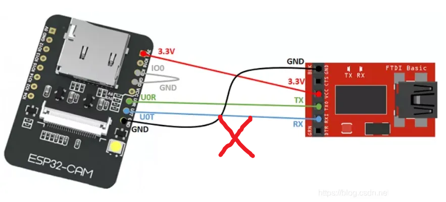

Herein, we adopt ESP32-CAM adapter, which is more convenient.  We just need to stack the ESP32-CAM into the adapter and directly connect to the computer via Type-c USB cable to download codes, as shown below.


**Adapter Board:**


The board is equipped with CH340 USB-to-serial converter which is responsible for data transmission between computer and ESP32-CAM. It also boasts a RESET button, a BOOT button, a power indicator, and a voltage regulator, which provide sufficient power support for the ESP32-CAM.

## 4.2 Adapter Board CH340 USB Driver

Before installing the driver, you need to connect the adapter board to the computer via a USB cable. The USB driver must be installed otherwise you will not find the port number of ESP32-CAM when uploading codes.

### 4.2.1 Windows

[Click to download Windows CH340 driver](./Windows.zip).


<p style="color:red;">Note: After downloading, unzip and store it. We recommend download it on desktop so you can easily find it.</p>

For Windows 10 or higher versions, the driver is built in computer.

Connect the board to your computer, and click Computer--Attributes--Device Manager. As shown below, the driver is installed.


If there is a yellow exclamation mark, you need to install the driver manually.


Click  to choose “**Update drive**” to update the driver.


Click “**Browse my computer for drivers**”.


Enter“**Browse...**” to find the file “usb_ch341_3.1.2009.06” and tap “**Next**”.


Close the page after installation, and then the serial port number appears.


Finally, click Computer--Attributes--Device Manager:


### 4.2.2 MAC：

[Click to download MAC CH340 driver](./MAC.zip).

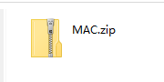

<p style="color:red;">Note: After downloading, unzip and store it. We recommend download it on desktop so you can easily find it.</p>

Step 1: Download the driver from the Website and extract the file to the local installation directory.


Step 2: For details about how to install the driver in pkg format by default, see Step 3. If OS X 11.0 or later does not support Rosetta, refer to Step 4 to install the dmg driver.

Before installation, please forward to “System Preferences”->“Security & Privacy”->“General” page, below the title “Allow apps downloaded from:” choose the choice 2->“Mac App Store and identified developers”, then the driver will work normally.


Step 3: To install the driver in pkg format, tap the driver file → Continue→ Install


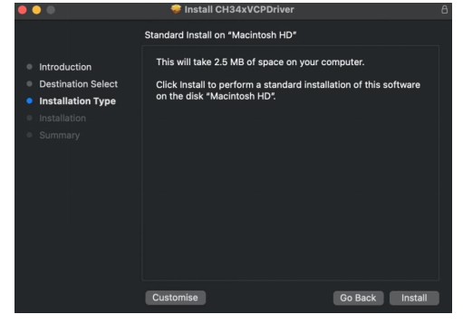

Then the installation will be successful


To install the pkg format driver on OS X 11.0 and later: Open “LaunchPad” → “CH34xVCPDriver” → Install


When using OS X 10.9 to OS X 10.15, click “Restart” to restart your computer, and perform the following steps after the restart.


Step 4: To install the dmg driver, tap the dmg file and drag “CH34xVCPDriver” to enter the application folder in the operating system.


Then open “LaunchPad” → “CH34xVCPDriver” → Install


Then the installation will be successful


When inserting the CH340 control board into the USB port, open System Report  →  Hardware → USB. On the right is USB Device Tree. If the USB device is working properly, you will find a device whose “Vendor ID” is [0x1a86].


Open “Terminal” program under Applications-Utilities folder and type the command “ls /dev/tty*”.

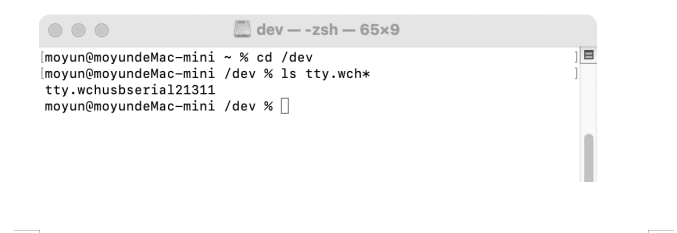

You should see the “tty.wchusbserialx” where “x” is the assigned device number similar to Windows COM port assignment.

# 5. Car Assembly

## 5.1 Mount Motors


Pay attention to the direction of each motor.


## 5.2 Assemble Wheels and the Car Body


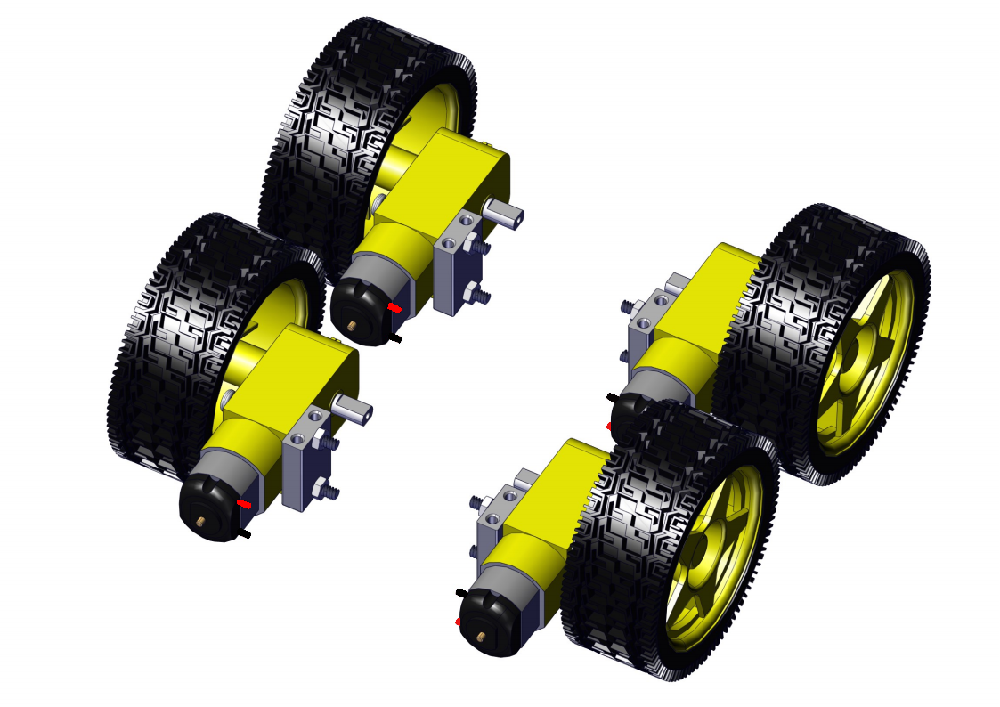

Pay attention to the direction of each motor.


## 5.3 Install Camera Part

Note that the acrylic board is relatively thick, so the antenna nut needs to be twisted off first, as shown below:


## 5.4 Install the Main Board


## 5.5 Mount Battery Holder


Pay attention to the direction of the battery holder.


## 5.6 Car Wiring

ESP32-CAM wiring diagram:

| ESP32-CAM | Motor drive board |
| :-------: | :---------------: |
|  GPIO14   |        IN1        |
|  GPIO15   |        IN2        |
|  GPIO13   |        IN3        |
|  GPIO12   |        IN4        |
|    5V     |        5V         |
|    GND    |        GND        |


Battery holder wiring diagram:

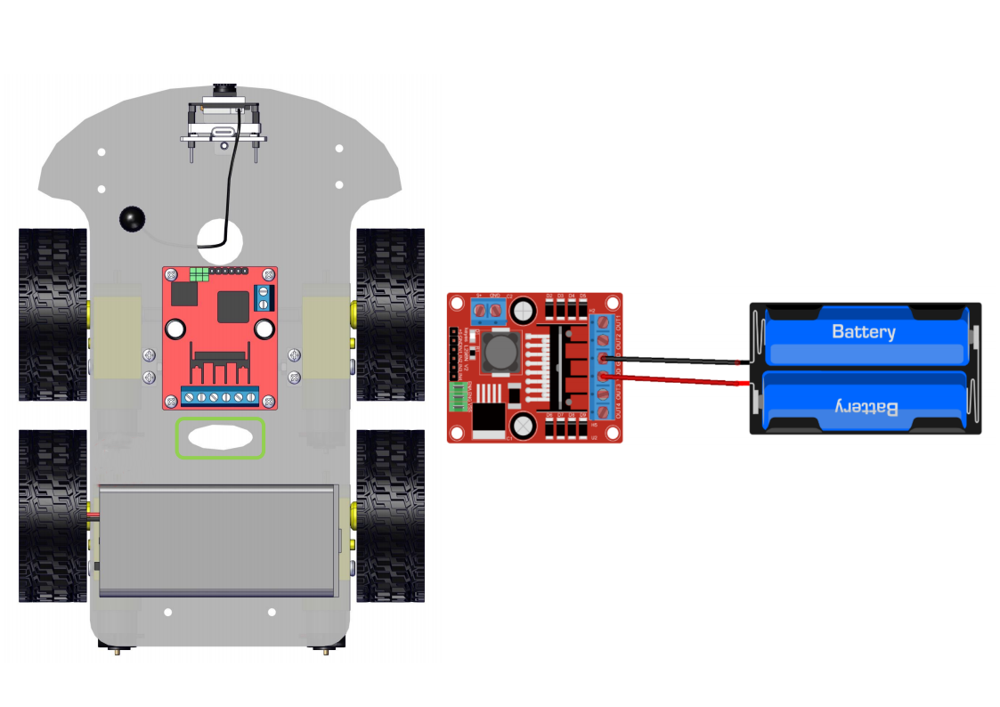

Right motor wiring diagram:

| Motor drive board | Right motor |
| :---------------: | :---------: |
|       OUT1        | Black wire  |
|       OUT2        |  Red wire   |


Left motor wiring diagram:

| Motor drive board | Left motor |
| :---------------: | :--------: |
|       OUT3        | Black wire |
|       OUT4        |  Red wire  |


# **6. About Arduino IDE**

## 6.1 Introduction to Arduino IDE

Arduino IDE is an integrated development environment dedicated to Arduino which is an open-source electronics platform based on easy-to-read interface and simplified programming process, aimed at students without a background in electronics. 

Its clear interface, syntax highlighting and auto-completion functions make the programming process easy and enjoyable. It also offers a wealth of tutorials, sample codes, and community support to help beginners get started quickly and solve practical  problems.

Importantly, it is published as an open source tool. Therefore,  it not only accelerates users own learning process by utilizing and referring others’ works, it is also available for extension experienced programmers to freely access, modify and distribute codes.

In one word, Arduino IDE is easy-to-use for beginners, yet flexible enough for advanced users to take advantage of as well.

## 6.2 Download Arduino IDE

### **6.2.1 For Windows**

Arduino official: [https://www.arduino.cc/](https://www.arduino.cc/)

Enter the website and click **SOFTWARE** to download the latest Arduino software:


Arduino boasts multiple versions such as Widows, mac and Linux(as shown below), please ensure that the one you download is compatible with your computer.


Here,  we will take Windows system as an example to introduce how to download and install it. Two versions are provided for Windows: for installing and for downloading(a zipped file, no need to install).


Click **JUST DOWNLOAD** to download the software. 

### **6.2.2  For MAC**

Its download method is similar to the Windows.

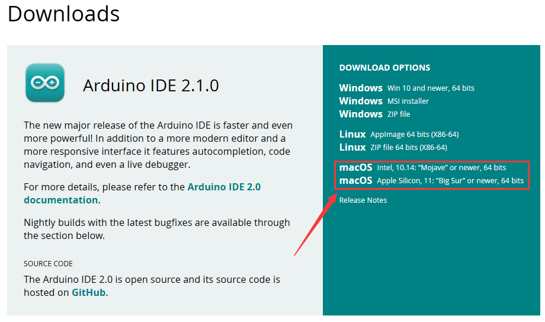

Follow the prompts to install.

### **6.2.3 Steps**

1.Save the .exe file downloaded from the software page to your hard drive and simply run the file .


2.Read the License Agreement and agree it.

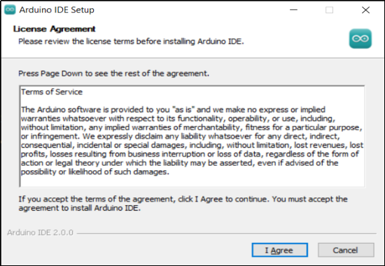

3.Choose the installation options.


4.Choose the install location.

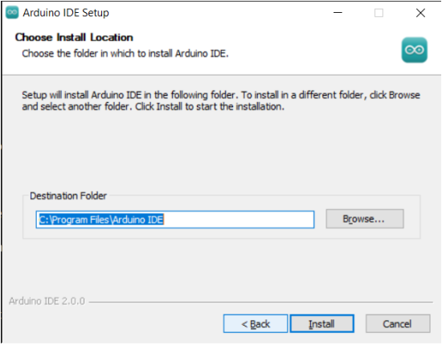

5.Click finish and run Arduino IDE


## 6.3  Install ESP32 Board

### 6.3.1 For Windows/MAC (under Stable Network Conditions)

Open Arduino IDE and click “Tools” → “Board”. But we cannot find ESP32, so we need to install it manually.


**Installation Steps of the ESP32：**

Open Arduino IDE.

Click “**File → Preferences**”, add the link **https://espressif.github.io/arduino-esp32/package_esp32_index.json** in Additional boards manager URLs and click **OK**.

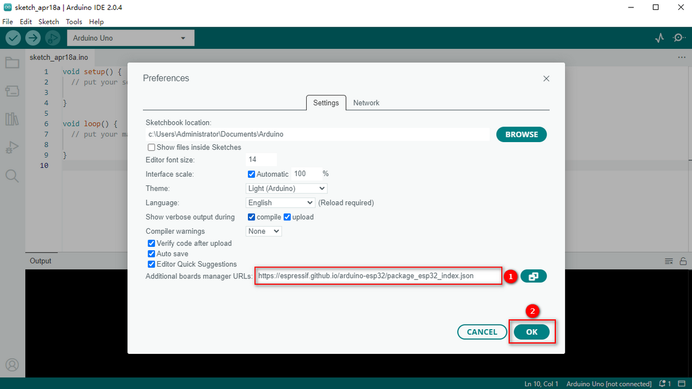

Select the icon of board manager to open the the board options.


Search for **ESP32** in the search box and click version `2.0.12` to install. **During installation, keep the network stable. If the installation fails, repeat the above steps.**

Note that here we choose ESP32 2.0.12. Please be consistent with us to avoid version incompatibility.


Click `Tools` and you will see the ESP32 development board.


### 6.3.2 For Windows (Fast Installation, Transferable-for-use)

A `ESP32 2.0.12` package is provided to directly download. After installing Arduino IDE, click this package to install `ESP32 2.0.12`. [Click here to download the ESP32 2.0.12 package](https://fs.keyestudio.com/ESP32).

After finishing download, close Arduino IDE and run the .exe file to install. After that, you will see the ESP32 on Arduino IDE. Note that this file may be mistaken for a virus, please feel free to use it.


Click `Tools` and you will see the ESP32 development board.


## 6.4 Use Arduino IDE

Clickicon，and open Arduino IDE.


1. **File** - includes new Sketch, open Sketch, open recently used code, open sample code, close the IDE, save code, preferences, advanced Settings, etc.
2. **Edit** - includes copy, paste, automatic formatting, font size, etc. (shortcut keys are recommended).
3. **Sketch** - includes verify\compile, upload code, import library and so on.
4. **Tools** - The most important two are development board and port.
5. **Help** - Views the IDE version and official reference documents.
6. **Open Serial Plotter** - displays serial data in a method of line graph
7. **Open Serial Monitor** - opens the Serial Monitor tool, as a new tab in the console.
8. **Verify** - compiles your code to your Arduino Board.
9. **Verify / Upload** - compiles and uploads your code to your Arduino Board.
10. **Sketchbook** - here you will find all of your sketches locally stored on your computer. Additionally, you can sync with the Arduino Cloud, and also obtain your sketches from the online environment.
11. **Boards Manager** - install or remove Arduino Boards .
12. **Library Manager** - browse through thousands of Arduino libraries or import local libraries
13. **Debugger** - test and debug programs in real time.
14. **Search** - search for keywords in your code.
15. **Code editing area**
16. **IDE prompt area** (Uploading fails or succeeds) & **Serial monitor display area**

## 6.5 Upload Code on Arduino IDE

Click `Tools` → `Board:"xxxxxx"` → `esp32`, scroll the mouse and find `AI Thnker ESP2-CAM` .


Choose COM port. You may check your port number at Device Manager. If there are many COM ports, unplug the cable of board to see which port disappears. Then that one is the port ready to use. If there is no COM port, please check whether driver is installed.


Herein, our COM port is COM3. Click “Tools” → “Port” → “COM3”.


When the board is connected, both of these places appear its model.


Now let’s upload code. 

Here we provide a sample code that prints “Hello Keyestudio!” once per second in the serial monitor.

Copy and paste the following code to Arduino IDE.

```c
/*
  keyestudio 
  Print “Hello Keyestudio!”
  http://www.keyestudio.com
*/
void setup() {  
    // put your setup code here, to run once:
    Serial.begin(9600);  //Set the serial port baud rate to 9600
}

void loop() {  
    // put your main code here, to run repeatedly:
    Serial.println("Hello Keyestudio!");  //Serial port printing
 	delay(1000);  //Delay of 1 second
}
```

Click  to compile and upload code. Two prompts will appear after upload is successful:


After that, click  to show serial monitor and set baud rate to 9600. You will see “Hello Keyestudio!” on the monitor.


1. **Toggle Auto-scroll** - Sets whether the prints scroll automatically
2. **Toggle Timestamp** - Sets whether to display print time
3. **Clear Output** - Clears printed messages
4. **Serial Input**
5. **Serial Output Format**
6. **Baud Rate** - Sets the baud rate you need
7. **Printing Window**

# 7. Basic Code in Arduino IDE

## 7.1 Arduino IDE Programming Language

The default option for programming your board to connect to the Arduino is by using the **C++ language**. 

C++ is often viewed as a superset of C, but there are a few of the differences between the two languages. C is procedural while C++ is object-oriented. Early Arduino core library was written in C, yet the latest library contains both C and C++ due to the idea of object orientation. 

Generally, Arduino Languages, which is also known as the Arduino API, is formed by the secondary encapsulation of the microcontroller libraries at lower levels. MCU users must deal with registers. Nonetheless, these API allows beginners to  control Arduino without complex register configuration, which improves development efficiency.

## 7.2 Program Structures

Arduino consists of two main functions:

`void setup(){}`

When the code starts running, setup () function is called. It initializes variables, sets pin modes, and  imports libraries. It runs only once when Arduino board is powered on or reset.

`void loop(){}`

It is equivalent to an endless loop while(1){}.

Of course, you can customize functions in the above two. Note that the two functions are essential, otherwise an error will be reported.

## 7.3 Common Statements

### 7.3.1 delay(value) ;

delay(); is a delay function, which is used where the program needs to wait.

​	Syntax: `delay(value)`

**value**: Delay time value (unit: ms); 1S = 1000mS, 1mS = 1000 uS; Generally we use mS

### 7.3.2 digitalWrite(Pin,State);

digitalWrite(); is used to control the specified pin to output HIGH or LOW

​	Syntax: `digitalWrite(pin, value)`

- **pin**: the Arduino pin number
- **value**: HIGH or LOW

### 7.3.3 digitalRead(Pin)

digitalRead(Pin) is used to read TTL level of digital pins, high (1), low (0)

​	Syntax: `digitalRead(Pin);`

**Pin:** The digital pin that needs to be read

### 7.3.4 analogWrite(Pin,Vlaue)

analogWrite(); outputs analog value (PWM signal). It can be used to light an LED at different brightness or drive a motor at different speeds. 

After analogWrite (); is called, this pin will generate a stable rectangular wave with the specified duty cycle until it is called next time on the same pin. So do digitalRead () and digitalWrite (). 

​	Syntax: `analogWrite(pin, value)`

- **pin:** the Arduino pin to write to. Allowed data types: int
- **value:** the duty cycle: between 0 (always off) and 255 (always on). Allowed data types: int

### 7.3.5 analogRead(Pin)

We learned the function of reading digital signals, and the analogRead() reads analog signals. ESP32-CAM analog values range from 0 to 4095

​	Syntax: `analogRead(Pin);`

**Pin:** The analog pin that needs to be read

### 7.3.6 pinMode(Pin,mode)

pinMode(); is used to set the specified pin to input or output or pull-up

​	Syntax: `pinMode(pin, mode)`

- **pin**: the Arduino pin number to set the mode of.
- **mode**: INPUT, OUTPUT, or INPUT_PULLUP

### 7.3.7 if(){...}else{…}

if() is used to check whether the condition is met. If yes, execute codes in  “{ }”. If not, skip the execution.

**else** is the condition for “not”. If not, execute codes in “else { }”

### 7.3.8 for()

`for` statement is a basic loop structure that repeats a block of code a fixed number of times. It is especially suitable for execution with a known number of cycles. 

​	Syntax of `for` loop:

```c
for (Initialization; Condition; Iterative command) {  
    // Loop: Codes to be executed repeatedly
}
```

- **Initialization**: Execute before the loop starts, usually to initialize one or more loop control variables.
- **Condition**: Check before each iteration of the loop. If the condition is true (non-zero), the loop is executed; If it is false (zero), the loop exits.
- **Iterative command**: Execute at the end of each loop iteration, usually to update these variables.


①: Set the initial value of the loop; execute only once; then enter ②

②: Determine whether to meet the condition. Herein, `i <= 255`, i is less than or equal to 255 to enter the loop code ③

③: Loop code, put the code that needs to loop here. For instance, if we need to control pwm value from 0 to 255, we set i to pwm and enter ④

④： i++ adds 1 to the value of original i, which also means i = i +1. So does i- -(i = i - 1). After that, run code ⑤

⑤： After i + 1 (or i - 1), determine whether i is less than or equal to 255. If yes, execute code ③. If not, exit the for loop.

### 7.3.9 while(condition){…}

The while loop runs indefinitely until the expression inside the () becomes false. It will never exit unless you change the test variable. This could be in your code, such as an incremental variable, or it could be an external condition, such as a test sensor.

### 7.3.10 Comparison Operators: “>,<,<=,>=,==,!=”

Comparing variables of different data types can produce unpredictable results. Therefore, it is recommended to operate in the same data type (including signed/unsigned types).

(1): `>` compares left and right values or variables. When the left operand is greater than the right, outputs true. Or else, returns false.

​	Syntax:

```c++
x > y; // is true if x is bigger than y and it is false if x is equal or smaller than y
```

---------

(2): `>=` compares left and right values or variables. When the left operand is greater than or equal to the right, outputs true. Or else, returns false.

​	Syntax:

```c++
x >= y; // is true if x is bigger than or equal to y and it is false if x is smaller than y
```

--------

(3): `<` compares left and right values or variables. When the left operand is smaller than the right, outputs true. Or else, returns false.

​	Syntax:

```c++
x < y; // is true if x is smaller than y and it is false if x is equal or bigger than y
```

------

(4): `<=` compares left and right values or variables. When the left operand is smaller than or equal to the right, outputs true. Or else, returns false.

​	Syntax: 

```c++
x <= y; // is true if x is smaller than or equal to y and it is false if x is greater than y
```

------------------

(5): `==` compares left and right values or variables. When the two operands equal to each other, outputs true. Or else, returns false. (Note that there are two equal signs “==”!)

​	Syntax: 

```c++
x == y; // is true if x is equal to y and it is false if x is not equal to y
```

-----------

(6): `!=` compares left and right values or variables. When the two operands do not equal to each other, outputs true. Or else, returns false.

​	Syntax: 

```c++
x != y; // is false if x is equal to y and it is true if x is not equal to y
```

### 7.3.11 Arithmetic Operators: “+,-,*,/,%,=”

(1): addition (`+`) is one of the four main arithmetic operations. The operator “+” (plus) sums up the two operands to get a result.

​	Syntax: `sum = operand1 + operand2;`

(2): subtraction (`-`) is one of the four main arithmetic operations. The operator “-” (minus) produces the difference value between the second operand and the first.

​	Syntax: `difference = operand1 - operand2;`

(3): multiplication (`*`) is one of the four main arithmetic operations. The operator “*” (asterisk) multiplies the two operands to get a result.

​	Syntax: `product = operand1 * operand2;`

(4): division method (`/`) is one of the four main arithmetic operations. The operator “/” divides the two operands to get a result.

​	Syntax: `result = numerator / denominator;`

(5): Remainder operation (`%`) calculates the remainder of an integer divided by another. It helps to keep variables within a specific range (such as the size of an array). The operator “%” (percent) is used to perform the remainder operation.

​	Syntax: `remainder = dividend % divisor;`

(6): A single equal sign (`=`) is an assigning operator in C++, which is a different meaning from that of equations in algebra. The operator “=” tells the MCU to assign any value or expression on the right of the equal sign and store it in the variable on the left.

​	Sample:

```c++
int sensVal;              // declare an integer variable named sensVal
    sensVal = analogRead(0);  // store the (digitized) input voltage at analog pin 0 in SensVal
```

### 7.3.12 Boolean Operators: “||,&&,!”

(1): `||` can be regard as “or”. If either of the two operands is true, the result of the logical OR is true.

​	Sample: 

```c++
if (x > 0 || y > 0) { // if either x or y is greater than zero
      // statements
    }
```

(2): `&&` can be regard as “and”. The result of a logical AND is true only if both operands are true.

​	Sample: 

```c++
if (digitalRead(2) == HIGH && digitalRead(3) == HIGH) { // if BOTH the switches read HIGH
      // statements
    }
```

### 7.3.13 #include

“#include” imports the external library(s) in a Sketch, so that programmers can access to considerable standard C libraries (groups of prefabricated functions), as well as exclusive libraries for Arduino.

​	Syntax: `#include <LibraryFile.h>`  or  `#include "LocalFile.h"`

### 7.3.14 #define

“#define” is used to set constant(a quantity that does not vary). 

​	Syntax: `#define constantName value`

- **constantName:** the name of the macro to define
- **value:** the value to assign to the macro

### 7.3.15 Serial.begin(9600)

Serial.begin(9600); sets serial baud rate. Serial port printing can be performed only after the baud rate is set to the same as that of the serial printing tool. 9600 and 115200 are the most common.

### 7.3.16 Serial.print()

Serial.print(); prints data without wrapping on the serial monitor. Enter characters(need to be placed in double quotes) or variables in parentheses.

### 7.3.17 Serial.println()

Serial.println(); prints data with wrapping on the serial monitor. Enter characters(need to be placed in double quotes) or variables in parentheses.

### 7.3.18 int

`int` declares integer variables. For example, `int i = 0;` declares a variable named i whose value equals to 0.

### 7.3.19 char

`char` declares character variables. For example, `chat ch = ‘A’` declares a character named ch whose content is ‘A’.

To learn more about the Arduino API, check out the [Language Reference | Arduino Documentation](https://docs.arduino.cc/language-reference/#variables).

# 8. Project Code Files

These files include source codes.

[Click to download the code files](./codes.zip).


# 9. On-board LED

## 9.1 Introduction to On-board LED


From its appearance, ESP32-CAM comes with an on-board LED. How to light it up? Let’s first figure out the control pins of this LED from the schematics of ESP32-CAM:


From schematic diagram, we can tell the pin of LED is GPIO4. Let’s take a look how this circuit controls the LED. 

LED positive pole is connected to 3.3V, while whether the negative is connected to GND depends on a triode. When GPIO4 outputs high, GND is connected. If it outputs low, the triode is not conducted so then disconnects the negative and GND. Yet why a triode? It is because the current output of GPIO is limited and cannot control large amount of current.

## 9.2 LED Blink

We program to turn on the LED for 500ms and then off for another 500ms. Repeat these actions and LED blinks.

```c++
/*
  Project: LED blink
  Author: Keyestudio
  Function: how to control LED on/off
*/
int ledPin = 4; //set variable ledPin to pin GPIO4
void setup() {
  // put your setup code here, to run once:
  pinMode(ledPin,OUTPUT); //set pin GPIO4 to output
}

void loop() {
  // put your main code here, to run repeatedly:
  digitalWrite(ledPin,HIGH);  //set pin GPIO4 to output high
  delay(500); //delay 500ms
  digitalWrite(ledPin,LOW); //set pin GPIO4 to output low
  delay(500); //delay 500ms
}

```

## 9.3 Breathing LED

We have learned how to turn on/off the LED. What about if we want to change its brightness? If so, PWM plays an important role. 

**What is PWM?**

Pulse width modulation, short for PWM, is a solution that simulates the change of analog signals through digital ones.

Pulse width is the high level in a complete square wave cycle. So, pulse width modulation is to adjust the high level (of course, in other words, low level is also adjusted because the cycle is fixed).


- PWM frequency

	the number of times the signal going from high level to low level and back to high level in 1 second (one cycle), that is, how many cycles there are in a second.

	Unit: Hz

	Expression: 50Hz 100Hz

- PWM cycle

	$ T= \frac {1}{f}$      $ Cycle= \frac {1}{frequency}$

	If the frequency is 50Hz, the cycle will be 20ms, i.e., there are 50 PWM cycles in one second.

- PWM duty cycle

	the ratio of high level time to the whole cycle time.

	- Unit: %(1% ~ 100%)


  - Cycle: The time of a pulse signal. The number of cycles in 1s equals the frequency.
  - Pulse width time: high level time.

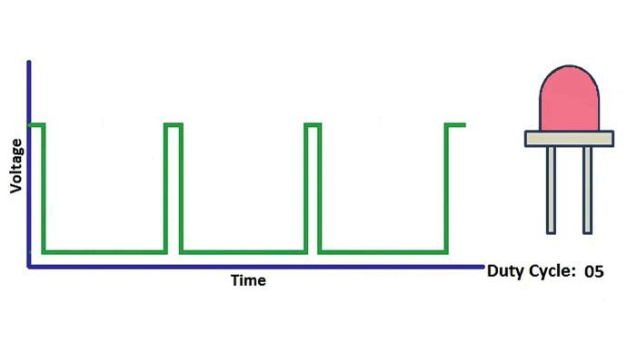

The relationship between duty cycle and LED brightness.gif


The longer the high level time is, the greater the duty cycle will be, and the brighter the LED will be.

PWM outputs through `analogWrite(Pin,Value)`, among which Pin is the output pin of PWM, and Value is PWM value (ranging from 0-255).

**Codes of Breathing LED:**

After upload the code, LED gradually lights up and dims to off. 

Conceive: Call analogWrite(Pin,Value) to output PWM, utilize for loop to operate PWM plus/minus 1, so that PWM value increases from 0 to 255 or deceases from 255 to 0.

```c++
/*
  Project: Breathing LED
  Author: Keyestudio
  Function: how to conttrol the brightness of LED
*/
int ledPin = 4;  //set variable ledPin to pin GPIO4
void setup() {
  // put your setup code here, to run once:
  pinMode(ledPin, OUTPUT);  //set pin GPIO4 to output
}

void loop() {
  // put your main code here, to run repeatedly:
  for (int i = 0; i <= 255; i++) {  //Loop increases the value of i from 0 to 255
    analogWrite(ledPin, i); //GPIO4 outputs as PWM and sets the PWM value to i
    delay(10);  //Delay 10ms
  }
  for (int i = 255; i >= 0; i--) {  //Loop reduces the value of i from 255 to 0
    analogWrite(ledPin, i); //GPIO4 outputs as PWM and sets the PWM value to i
    delay(10);
  }
}

```

# 10. L298N Module


## 10.1 Introduction to L298N

The L298 motor drive module, produced by ST Semiconductor Group, integrates a dual-way full-bridge motor drive chip, which is commonly used to drive relays, solenoids, solenoid valves, DC motors, and stepper motors. L298N(N is the package identifier for the L298) is able to drive a two- or four-phase stepper motor, or two DC motors.

## 10.2 L298N Parameters

- Drive part terminal power supply VDD: 5V~35V
- Drive part peak current Io: 2A
- Logic part terminal power supply: 5V
- Logical part operating current: 0~36mA
- Control signal input voltage: LOW, HIGH
- Enable signal input voltage: LOW(invalid control signals), HIGH(valid control signals)

## 10.2 L298N Pinout

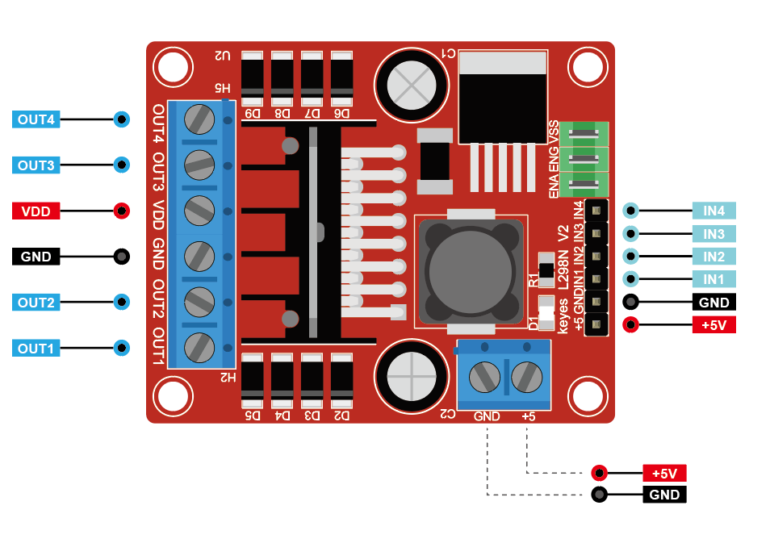

## 10.3 Circuit Design

We connect 9V batteries to the board to supply power to the car:

\- Connect battery positive to L298N +VDD

\- Connect battery negative to L298N GND

 

We use L298N +5V as the power supply for the ESP32-CAM module:

\- Insert the power jumper on the L298N

 \- Connect L298N +5V to ESP32-CAM 5V

 \- Connect L298N GND to ESP32-CAM GND

 

Signal connection of ESP32-CAM and L298N is as below: 

\- Connect L298N IN1 to ESP32-CAM GPIO 14  

 \- Connect L298N IN2 to ESP32-CAM GPIO 15  

 \- Connect L298N IN3 to ESP32-CAM GPIO 13  

 \- Connect L298N IN4 to ESP32-CAM GPIO 12  

 

Since we will not control the speed, the car will run at maximum speed, so just plug in the ENA and ENB jumpers.

Complete circuit connection:

|        Function         | ESP32-CAM | Motor drive board | Left motor | Right motor |
| :---------------------: | :-------: | :---------------: | :--------: | :---------: |
| Right motor control pin |  GPIO14   |        IN1        |            |             |
| Right motor control pin |  GPIO15   |        IN2        |            |             |
| Left motor control pin  |  GPIO13   |        IN3        |            |             |
| Left motor control pin  |  GPIO12   |        IN4        |            |             |
|    ESP32-CAM power +    |    5V     |        5V         |            |             |
|    ESP32-CAM power -    |    GND    |        GND        |            |             |
| Right motor output pin  |           |       OUT1        |            | black wire  |
| Right motor output pin  |           |       OUT2        |            |  red wire   |
|  Left motor output pin  |           |       OUT3        | black wire |             |
|  Left motor output pin  |           |       OUT4        |  red wire  |             |

 

## 10.4 Motor Drive Logic

Take the car as a reference, so the rotation direction of two motors is forwards if the car moves forward, while it is reversal if the car moves backward.

The left motor is controlled by GPIO12 and GPIO13; the right one is controlled by GPIO13 and GPIO14.

| Car state  | GPIO12(L) | GPIO13(L) | GPIO14(R) | GPIO15(R) | Left motor | Right motor |
| :--------: | :-------: | :-------: | :-------: | :-------: | :--------: | :---------: |
|  FORWARD   |    LOW    |   HIGH    |    LOW    |   HIGH    |  forwards  |  forwards   |
|  BACKWARD  |   HIGH    |    LOW    |   HIGH    |    LOW    |  reversal  |  reversal   |
| TURN LEFT  |   HIGH    |    LOW    |    LOW    |   HIGH    |  reversal  |  forwards   |
| TURN RIGHT |    LOW    |   HIGH    |   HIGH    |    LOW    |  forwards  |  reversal   |
|    STOP    |    LOW    |    LOW    |    LOW    |    LOW    |    stop    |    stop     |

## 10.5 Codes to Drive Motors

After uploading the code, the car moves forward and backward, and turns left and right, and then stops. Each action lasts 2 seconds and all actions loop in this order.

```c++
/*
  Project: motor drive
  Author: Keyestudio
  Function: how to control car move forward and backward, turn left and right
*/

//set motor control pins
#define MOTOR_R_PIN_1 14  
#define MOTOR_R_PIN_2 15
#define MOTOR_L_PIN_1 13
#define MOTOR_L_PIN_2 12

void setup() {
  //set serial baud rate
  Serial.begin(115200);
  //set pin modes
  pinMode(MOTOR_R_PIN_1, OUTPUT);
  pinMode(MOTOR_R_PIN_2, OUTPUT);
  pinMode(MOTOR_L_PIN_1, OUTPUT);
  pinMode(MOTOR_L_PIN_2, OUTPUT);
}

void loop() {
   //Forward
  Serial.println("Forward");
  digitalWrite(MOTOR_R_PIN_1, LOW);
  digitalWrite(MOTOR_R_PIN_2, HIGH);
  digitalWrite(MOTOR_L_PIN_1, HIGH);
  digitalWrite(MOTOR_L_PIN_2, LOW);
  delay(2000);
  // Backward
  Serial.println("Backward");
  digitalWrite(MOTOR_R_PIN_1, HIGH);
  digitalWrite(MOTOR_R_PIN_2, LOW);
  digitalWrite(MOTOR_L_PIN_1, LOW);
  digitalWrite(MOTOR_L_PIN_2, HIGH);
  delay(2000);
  // Left
  Serial.println("Left");
  digitalWrite(MOTOR_R_PIN_1, LOW);
  digitalWrite(MOTOR_R_PIN_2, HIGH);
  digitalWrite(MOTOR_L_PIN_1, LOW);
  digitalWrite(MOTOR_L_PIN_2, HIGH);
  delay(2000);
  // Right
  Serial.println("Right");
  digitalWrite(MOTOR_R_PIN_1, HIGH);
  digitalWrite(MOTOR_R_PIN_2, LOW);
  digitalWrite(MOTOR_L_PIN_1, HIGH);
  digitalWrite(MOTOR_L_PIN_2, LOW);
  delay(2000);
  // Stop
  Serial.println("Stop");
  digitalWrite(MOTOR_R_PIN_1, LOW);
  digitalWrite(MOTOR_R_PIN_2, LOW);
  digitalWrite(MOTOR_L_PIN_1, LOW);
  digitalWrite(MOTOR_L_PIN_2, LOW);
  delay(2000);
}  
```


## 10.6 Codes to Control Speed

The pervious project drive the car at a full speed. If we want to adjust the speed, the digital output need to be replaced with PWM output. 

First define two variables as speed values, and then change the PWM output to them. In this way, the PWM output can be controlled by modifying these variables, so as to control the speed of the car.

```c++
/*
  Project: adjust motor speed
  Author: Keyestudio
  Function: how to control the moving speed of the car
*/
//set motor control pins
#define MOTOR_R_PIN_1 14
#define MOTOR_R_PIN_2 15
#define MOTOR_L_PIN_1 13
#define MOTOR_L_PIN_2 12
//Define the initial value of the speed to be 100; if you want to change the speed of the car, just change the values of the two variables (range from 0 to 255).
int MOTOR_R_Speed = 100;
int MOTOR_L_Speed = 100;

void setup() {
  //set serial baud rate
  Serial.begin(115200);
  //set pin modes
  pinMode(MOTOR_R_PIN_1, OUTPUT);
  pinMode(MOTOR_R_PIN_2, OUTPUT);
  pinMode(MOTOR_L_PIN_1, OUTPUT);
  pinMode(MOTOR_L_PIN_2, OUTPUT);
}

void loop() {
  // put your main code here, to run repeatedly:
   //Forward .  Use analogWrite to output analog values for speed control
  analogWrite(MOTOR_R_PIN_1, 0);
  analogWrite(MOTOR_R_PIN_2, MOTOR_R_Speed);
  analogWrite(MOTOR_L_PIN_1, MOTOR_L_Speed);
  analogWrite(MOTOR_L_PIN_2, 0);
  delay(2000);
  // Backward
  Serial.println("Backward");
  analogWrite(MOTOR_R_PIN_1, MOTOR_R_Speed);
  analogWrite(MOTOR_R_PIN_2, 0);
  analogWrite(MOTOR_L_PIN_1, 0);
  analogWrite(MOTOR_L_PIN_2, MOTOR_L_Speed);
  delay(2000);
  // Left
  Serial.println("Left");
  analogWrite(MOTOR_R_PIN_1, 0);
  analogWrite(MOTOR_R_PIN_2, MOTOR_R_Speed);
  analogWrite(MOTOR_L_PIN_1, 0);
  analogWrite(MOTOR_L_PIN_2, MOTOR_L_Speed);
  delay(2000);
  // Right
  Serial.println("Right");
  analogWrite(MOTOR_R_PIN_1, MOTOR_R_Speed);
  analogWrite(MOTOR_R_PIN_2, 0);
  analogWrite(MOTOR_L_PIN_1, MOTOR_L_Speed);
  analogWrite(MOTOR_L_PIN_2, 0);
  delay(2000);
  // Stop
  Serial.println("Stop");
  analogWrite(MOTOR_R_PIN_1, 0);
  analogWrite(MOTOR_R_PIN_2, 0);
  analogWrite(MOTOR_L_PIN_1, 0);
  analogWrite(MOTOR_L_PIN_2, 0);
  delay(2000);
}  
```


# 11. Camera Robot Car

## 11.1 Introduction

We know how to control the car motor. Next, we will control the direction of the car and the LED on/off via ESP32-CAM WiFi. Also, scene in front of the car will be transmitted in real time through the ESP32-CAM camera.

## 11.2 ESP32-CAM WiFi

ESP32 development board comes with built-in Wi-Fi (2.4G) and Bluetooth (4.2), which enable it to easily connect to Wi-Fi network and communicate with other devices in the network. You can display web pages in your browser via ESP32.


**Arduino IDE provides \<WiFi.h\> library files that supports the configuration and monitoring of ESP32 Wi-Fi networking.**

- Base station mode (STA / Wi-Fi Client mode): ESP32 is connected to Wi-Fi hotspot (AP).
- AP mode (Soft-AP / Wi-Fi hotspot mode): Wi-Fi device(s) is(are) connected to ESP32.
- AP-STA mode: ESP32 is both Wi-Fi hotspot and a Wi-Fi device connected to another Wi-Fi.
- These modes supports multiple security modes, including WPA, WPA2 and WEP.
- It is able to scan Wi-Fi hotspot (active or passive).
- It support promiscuous mode monitoring IEEE802.11 Wi-Fi packets.

------

For more wifi reference, please visit: [https://docs.espressif.com/projects/esp-idf/en/latest/esp32/api-reference/network/esp_wifi.html](https://docs.espressif.com/projects/esp-idf/en/latest/esp32/api-reference/network/esp_wifi.html)

espressif official: [https://www.espressif.com.cn/en/home](https://www.espressif.com.cn/en/home)


--------

Firstly, make sure Wi-Fi connection is correctly set on ESP32. You can connect your ESP32 to Wi-Fi after uploading the following code:

```c++
/*
  Project: print WiFi IP
  Author: Keyestudio
  Function: how to connect ESP32 to WiFi and output ESP32 ip address
*/
//Import wifi library
#include <WiFi.h>

//Set “your_SSID” to your wifi name
const char* ssid = "your_SSID";
//Set “your_PASSWORD” to your wifi passwords
const char* password = "your_PASSWORD";

void setup() {
  Serial.begin(9600);
  //Initialize wifi
  WiFi.begin(ssid, password);
  //Scan wifi; if connection is not complete, it is always in the state of connecting; while loop
  while (WiFi.status() != WL_CONNECTED) {
    delay(1000);
    Serial.println("Connecting to WiFi...");
  }
  //The connection is successful. Print the IP address
  Serial.println("Connected to WiFi");
  Serial.println(WiFi.localIP());
}

void loop() {
}
```

In the code, please replace `ssid` and `password` with your Wi-Fi name and passwords.

```c++
const char* ssid = "your_SSID";
const char* password = "your_PASSWORD";
```

<p style="color:red;">Note: ESP32 can only connect to WiFi with frequency of 2.4GHz. If not, connection will fail. Also, when using WiFi, antenna must be connected; otherwise network will be poor.</p>

This code will connect the module to Wi-Fi network and print the connection status on the serial monitor.


## 11.3 Web Page Display

We use ESP32's Web server library to serve web pages. In the following sample code, we will create a web page that displays “Hello, World”:

```c++
/*
  Project: Web Page Display
  Author: Keyestudio
  Function: how to connect ESP32 to WiFi and design web page to show “Hello World”
*/
#include <WiFi.h>
#include "esp_camera.h"
#include "esp_http_server.h"

// Replace with your network credentials
const char *ssid = "your_SSID";          // Set to your Wi-Fi name
const char *password = "your_PASSWORD";  // Set to your Wi-Fi passwords

httpd_handle_t camera_httpd = NULL;  // HTTP server handle, used to start the server

// A simplified HTML page that contains only the content of the title
static const char PROGMEM INDEX_HTML[] = R"rawliteral(
<html>
  <head>
  <body>
    <h1>Hello World</h1>  <!-- Title text in the body of the page -->
  </body>
</html>
)rawliteral";

// Callback function that handles root URL ("/") requests
static esp_err_t index_handler(httpd_req_t *req) {
  httpd_resp_set_type(req, "text/html");  // Set the content type of the response to HTML
  return httpd_resp_send(req, (const char *)INDEX_HTML, strlen(INDEX_HTML));  // Send an HTML response with a title
}

// Start the HTTP Server and register requests to handle the root path ("/")
void startCameraServer() {
  httpd_config_t config = HTTPD_DEFAULT_CONFIG();  // Use the default HTTP configuration
  config.server_port = 80;  // Set the HTTP server port to 80

  // Configure request handling for the root path ("/")
  httpd_uri_t index_uri = {
    .uri = "/",               // Set the request URI path to "/"
    .method = HTTP_GET,       // Set the request method to GET
    .handler = index_handler, // Set the callback function that handles the request
    .user_ctx = NULL          // No additional context data
  };

  // Start the HTTP Server and register the root path for request processing
  if (httpd_start(&camera_httpd, &config) == ESP_OK) {
    httpd_register_uri_handler(camera_httpd, &index_uri);  // Register URI handlers
  }
}

void setup() {
  Serial.begin(115200);  // Set baud rate to 115200

  // Connect to Wi-Fi network
  WiFi.begin(ssid, password);  // Start the Wi-Fi connection
  while (WiFi.status() != WL_CONNECTED) {  // If Wi-Fi is not connected, wait
    delay(500);  // Print every 500ms
    Serial.print(".");  // Print dots on the serial monitor to indicate that a connection is being attempted
  }
  Serial.println("");  // wrap
  Serial.println("WiFi connected");  // Print "WiFi connected" when the Wi-Fi connection is successful
  Serial.print("IP Address: ");
  Serial.println(WiFi.localIP());   // Print IP address
  // Start the HTTP Server
  startCameraServer();  // Start the HTTP Server and register the handler
}

void loop() {
  // The main loop is empty because the HTTP server processes the request in the background
}

```

In the code, please replace `ssid` and `password` with your Wi-Fi name and passwords.

```c++
const char* ssid = "your_SSID";
const char* password = "your_PASSWORD";
```

<p style="color:red;">Note: ESP32 can only connect to WiFi with frequency of 2.4GHz. If not, connection will fail. Also, when using WiFi, antenna must be connected; otherwise network will be poor.</p>

After uploading code, open the serial monitor and you will see the IP address of the WiFi connected to ESP32-CAM. If nothing appears, press the reset button on the module. Connect your device to the same WiFi and open its browser, and you can see the web page:


## 11.4 Codes of Camera Car

**Note: This project involves extracurricular knowledge like HTML, CSS and JS, please Google for details as here is only a brief introduction.**

Herein, we will control the car through web page and monitor conditions ahead of it.

In the code, please replace `ssid` and `password` with your Wi-Fi name and passwords. For mobile phone users, please turn on a 2.5GHz hotspot on you phone for ESP32-CAM. It’s faster.

```c++
const char *SSID = "your_SSID";
const char *PASS = "your_PASSWORD";
```

<p style="color:red;">Note: ESP32 can only connect to WiFi with frequency of 2.4GHz. If not, connection will fail. Also, when using WiFi, antenna must be connected; otherwise network will be poor.</p>

 **Test Code:**

```c++
/*
  Project: camera robot car
  Author: Keyestudio
  Function: We can control the car to move forward/backward and turn left/right, turn on/off LED and speed up/down speed through wifi
  Speed level: we divide the maximum value of 255 into three parts, so each is 85. low speed 85, mid speed 170, high speed 255
*/
#include "esp_camera.h"        //ESP32-CAM camera driver
#include <WiFi.h>              //WiFi library, used to connect to network
#include "esp_timer.h"         //timer library
#include "img_converters.h"    //image converter library, used to convert JPEG
#include "Arduino.h"           //Arduino library
#include "fb_gfx.h"            //Graphics library, used to display image buffers
#include "soc/soc.h"           // Used to disable brownout detection for ESP32
#include "soc/rtc_cntl_reg.h"  // Used to disable brownout detection for ESP32
#include "esp_http_server.h"   // ESP32 HTTP server library, used to handle Web requests

// Replace with your network credentials
const char *ssid = "your_SSID";      // Set to your Wi-Fi name
const char *password = "your_PASSWORD";  // Set to your Wi-Fi passwords

//Set camera pins
#define PWDN_GPIO_NUM 32
#define RESET_GPIO_NUM -1
#define XCLK_GPIO_NUM 0
#define SIOD_GPIO_NUM 26
#define SIOC_GPIO_NUM 27

#define Y9_GPIO_NUM 35
#define Y8_GPIO_NUM 34
#define Y7_GPIO_NUM 39
#define Y6_GPIO_NUM 36
#define Y5_GPIO_NUM 21
#define Y4_GPIO_NUM 19
#define Y3_GPIO_NUM 18
#define Y2_GPIO_NUM 5
#define VSYNC_GPIO_NUM 25
#define HREF_GPIO_NUM 23
#define PCLK_GPIO_NUM 22

//Set motor pins
#define MOTOR_R_PIN_1 14
#define MOTOR_R_PIN_2 15
#define MOTOR_L_PIN_1 13
#define MOTOR_L_PIN_2 12
//Set LED pins
#define LED_GPIO_NUM 4  
//The variable of speed value is initially 85
int MOTOR_R_Speed = 85;
int MOTOR_L_Speed = 85;

#define PART_BOUNDARY "123456789000000000000987654321" // A boundary used to split MIME streams
static const char *_STREAM_CONTENT_TYPE = "multipart/x-mixed-replace;boundary=" PART_BOUNDARY;
static const char *_STREAM_BOUNDARY = "\r\n--" PART_BOUNDARY "\r\n";
static const char *_STREAM_PART = "Content-Type: image/jpeg\r\nContent-Length: %u\r\n\r\n";

httpd_handle_t camera_httpd = NULL;
httpd_handle_t stream_httpd = NULL;

void startCameraServer();

void setup() {
  WRITE_PERI_REG(RTC_CNTL_BROWN_OUT_REG, 0);  //disable brownout detector

  pinMode(MOTOR_R_PIN_1, OUTPUT);
  pinMode(MOTOR_R_PIN_2, OUTPUT);
  pinMode(MOTOR_L_PIN_1, OUTPUT);
  pinMode(MOTOR_L_PIN_2, OUTPUT);
  pinMode(LED_GPIO_NUM, OUTPUT);  // LED is initially in output mode
  Serial.begin(115200);
  Serial.setDebugOutput(false);

//Configure camera
  camera_config_t config;
  config.ledc_channel = LEDC_CHANNEL_0;
  config.ledc_timer = LEDC_TIMER_0;
  config.pin_d0 = Y2_GPIO_NUM;
  config.pin_d1 = Y3_GPIO_NUM;
  config.pin_d2 = Y4_GPIO_NUM;
  config.pin_d3 = Y5_GPIO_NUM;
  config.pin_d4 = Y6_GPIO_NUM;
  config.pin_d5 = Y7_GPIO_NUM;
  config.pin_d6 = Y8_GPIO_NUM;
  config.pin_d7 = Y9_GPIO_NUM;
  config.pin_xclk = XCLK_GPIO_NUM;
  config.pin_pclk = PCLK_GPIO_NUM;
  config.pin_vsync = VSYNC_GPIO_NUM;
  config.pin_href = HREF_GPIO_NUM;
  config.pin_sccb_sda = SIOD_GPIO_NUM;
  config.pin_sccb_scl = SIOC_GPIO_NUM;
  config.pin_pwdn = PWDN_GPIO_NUM;
  config.pin_reset = RESET_GPIO_NUM;
  config.xclk_freq_hz = 20000000;
  config.pixel_format = PIXFORMAT_JPEG;

  if (psramFound()) {
    config.frame_size = FRAMESIZE_VGA;
    config.jpeg_quality = 10;
    config.fb_count = 2;
  } else {
    config.frame_size = FRAMESIZE_HVGA;
    config.jpeg_quality = 12;
    config.fb_count = 1;
  }

  // Camera init
  esp_err_t err = esp_camera_init(&config);
  if (err != ESP_OK) {
    Serial.printf("Camera init failed with error 0x%x", err);
    return;
  }
  // Wi-Fi connection
  WiFi.begin(ssid, password);
  while (WiFi.status() != WL_CONNECTED) {
    delay(500);
    Serial.print(".");
  }
  Serial.println("");
  Serial.println("WiFi connected");

  Serial.print("Camera Stream Ready! Go to: http://");
  Serial.println(WiFi.localIP());

  // Start streaming web server
  startCameraServer();
}

void loop() {
}

//Design control web page
static const char PROGMEM INDEX_HTML[] = R"rawliteral(
<html>
  <head>
    <title>ESP32-CAM Robot</title>
    <meta name="viewport" content="width=device-width, initial-scale=1">
    <meta charset="UTF-8"/>

    <style>
      body {
        font-family: Arial;
        text-align: center;
        margin: 0 auto;
        padding-top: 20px;
      }

      .button-container {
        display: grid;
        grid-template-areas:
          "keyes forward led"
          "left stop right"
          "plus backward minus";  /* Adjust position */
        grid-gap: 10px;
        justify-content: center;
        align-content: center;
        margin-top: 20px;
      }

      .button {
        background-color: #2f4468;
        color: white;
        border: none;
        padding: 20px 0;
        text-align: center;
        font-size: 18px;
        cursor: pointer;
        width: 90px; /* Uniform width */
        height: 60px; /* Uniform heigth */
        border-radius: 15px; /* Fillet corner */
      }

      .led-button {
        background-color: #777; /* Initial gray, LED off */
        color: white;
        border: none;
        padding: 20px 0;
        text-align: center;
        font-size: 18px;
        cursor: pointer;
        width: 90px;
        height: 60px;
        border-radius: 15px;
      }

      .led-on {
        background-color: #f0c40f; /* Yellow, LED on */
        color: black;
      }

      .forward { grid-area: forward; }
      .led { grid-area: led; }
      .left { grid-area: left; }
      .stop { grid-area: stop; }
      .right { grid-area: right; }
      .backward { grid-area: backward; }
      .backwa { grid-area: backwa; }
      .plus { grid-area: plus; }
      .minus { grid-area: minus; }
      .keyes { grid-area: keyes; }

      img {
        width: auto;
        max-width: 100%;
        height: auto;
        border: 2px solid #2f4468; /* Give the video a border */
        border-radius: 10px;
        margin-top: 20px;
      }
    </style>
  </head>
  <body>
    <h1>ESP32-CAM Robot</h1>
    
    <!-- Video stream display -->
    

    <!-- Button container -->
    <div class="button-container">
      <!-- Forward -->
      <button class="button forward" onmousedown="toggleCheckbox('forward');" ontouchstart="toggleCheckbox('forward');" onmouseup="toggleCheckbox('stop');" ontouchend="toggleCheckbox('stop');">↑</button>
      
      <!-- LED on/off -->
      <button id="ledButton" class="led-button led" onclick="toggleLED()">OFF</button>
      
      <!-- other buttons -->
      <button class="button left" onmousedown="toggleCheckbox('left');" ontouchstart="toggleCheckbox('left');" onmouseup="toggleCheckbox('stop');" ontouchend="toggleCheckbox('stop');">←</button>
      <button class="button stop" onmousedown="toggleCheckbox('stop');">●</button>
      <button class="button right" onmousedown="toggleCheckbox('right');" ontouchstart="toggleCheckbox('right');" onmouseup="toggleCheckbox('stop');" ontouchend="toggleCheckbox('stop');">→</button>
      <button class="button backward" onmousedown="toggleCheckbox('backward');" ontouchstart="toggleCheckbox('backward');" onmouseup="toggleCheckbox('stop');" ontouchend="toggleCheckbox('stop');">↓</button>
      <button class="button plus"  onmouseup="toggleCheckbox('plus');">+</button>
      <button class="button minus" onmouseup="toggleCheckbox('minus');">-</button>
      <button class="button keyes" >Keyes</button>
    </div>

    <script>
      // Video stream loading
      window.onload = function () {
        document.getElementById("photo").src = window.location.href.slice(0, -1) + ":81/stream";
      };

      // Control button request
      function toggleCheckbox(action) {
        var xhr = new XMLHttpRequest();
        xhr.open("GET", "/action?go=" + action, true);
        xhr.send();
      }

      // Logic of LED on/off
      let ledState = false; // LED state
      const ledButton = document.getElementById("ledButton");

      function toggleLED() {
        ledState = !ledState; // switch state
        if (ledState) {
          ledButton.classList.add("led-on");
          ledButton.textContent = "ON";
        } else {
          ledButton.classList.remove("led-on");
          ledButton.textContent = "OFF";
        }

        // Send LED state to server
        var xhr = new XMLHttpRequest();
        xhr.open("GET", "/action?led=" + (ledState ? "on" : "off"), true);
        xhr.send();
      }
    </script>
  </body>
</html>
)rawliteral";

static esp_err_t index_handler(httpd_req_t *req) {
  httpd_resp_set_type(req, "text/html");
  return httpd_resp_send(req, (const char *)INDEX_HTML, strlen(INDEX_HTML));
}

static esp_err_t stream_handler(httpd_req_t *req) {
  camera_fb_t *fb = NULL;
  esp_err_t res = ESP_OK;
  size_t _jpg_buf_len = 0;
  uint8_t *_jpg_buf = NULL;
  char *part_buf[64];

  res = httpd_resp_set_type(req, _STREAM_CONTENT_TYPE);
  if (res != ESP_OK) {
    return res;
  }

  while (true) {
    fb = esp_camera_fb_get();
    if (!fb) {
      Serial.println("Camera capture failed");
      res = ESP_FAIL;
    } else {
      if (fb->width > 400) {
        if (fb->format != PIXFORMAT_JPEG) {
          bool jpeg_converted = frame2jpg(fb, 80, &_jpg_buf, &_jpg_buf_len);
          esp_camera_fb_return(fb);
          fb = NULL;
          if (!jpeg_converted) {
            Serial.println("JPEG compression failed");
            res = ESP_FAIL;
          }
        } else {
          _jpg_buf_len = fb->len;
          _jpg_buf = fb->buf;
        }
      }
    }
    if (res == ESP_OK) {
      size_t hlen = snprintf((char *)part_buf, 64, _STREAM_PART, _jpg_buf_len);
      res = httpd_resp_send_chunk(req, (const char *)part_buf, hlen);
    }
    if (res == ESP_OK) {
      res = httpd_resp_send_chunk(req, (const char *)_jpg_buf, _jpg_buf_len);
    }
    if (res == ESP_OK) {
      res = httpd_resp_send_chunk(req, _STREAM_BOUNDARY, strlen(_STREAM_BOUNDARY));
    }
    if (fb) {
      esp_camera_fb_return(fb);
      fb = NULL;
      _jpg_buf = NULL;
    } else if (_jpg_buf) {
      free(_jpg_buf);
      _jpg_buf = NULL;
    }
    if (res != ESP_OK) {
      break;
    }
    //Serial.printf("MJPG: %uB\n",(uint32_t)(_jpg_buf_len));
  }
  return res;
}

// Control action processing
static esp_err_t action_handler(httpd_req_t *req) {
  char query[100];
  int len = httpd_req_get_url_query_len(req) + 1;
  if (len > sizeof(query)) {
    httpd_resp_send_404(req);
    return ESP_OK;
  }

  if (httpd_req_get_url_query_str(req, query, len) == ESP_OK) {
    if (strstr(query, "go=forward")) {
      // Forward
      Serial.println("Forward");
      analogWrite(MOTOR_R_PIN_1, 0);
      analogWrite(MOTOR_R_PIN_2, MOTOR_R_Speed);
      analogWrite(MOTOR_L_PIN_1, MOTOR_L_Speed);
      analogWrite(MOTOR_L_PIN_2, 0);
    } else if (strstr(query, "go=backward")) {
      // Backward
      Serial.println("Backward");
      analogWrite(MOTOR_R_PIN_1, MOTOR_R_Speed);
      analogWrite(MOTOR_R_PIN_2, 0);
      analogWrite(MOTOR_L_PIN_1, 0);
      analogWrite(MOTOR_L_PIN_2, MOTOR_L_Speed);
    } else if (strstr(query, "go=left")) {
      // Left
      Serial.println("Left");
      analogWrite(MOTOR_R_PIN_1, 0);
      analogWrite(MOTOR_R_PIN_2, MOTOR_R_Speed);
      analogWrite(MOTOR_L_PIN_1, 0);
      analogWrite(MOTOR_L_PIN_2, MOTOR_L_Speed);
    } else if (strstr(query, "go=right")) {
      // Right
      Serial.println("Right");
      analogWrite(MOTOR_R_PIN_1, MOTOR_R_Speed);
      analogWrite(MOTOR_R_PIN_2, 0);
      analogWrite(MOTOR_L_PIN_1, MOTOR_L_Speed);
      analogWrite(MOTOR_L_PIN_2, 0);
    } else if (strstr(query, "go=stop")) {
      // Stop
      Serial.println("Stop");
      analogWrite(MOTOR_R_PIN_1, 0);
      analogWrite(MOTOR_R_PIN_2, 0);
      analogWrite(MOTOR_L_PIN_1, 0);
      analogWrite(MOTOR_L_PIN_2, 0);
    } else if (strstr(query, "led=on")) {
      Serial.println("LED ON");
      digitalWrite(LED_GPIO_NUM, HIGH);  // LED on
    } else if (strstr(query, "led=off")) {
      Serial.println("LED OFF");
      digitalWrite(LED_GPIO_NUM, LOW);  // LED off
    } else if (strstr(query, "go=plus")) {  

      MOTOR_R_Speed = MOTOR_R_Speed + 85;
      MOTOR_L_Speed = MOTOR_L_Speed + 85;
      if (MOTOR_L_Speed >= 255) MOTOR_L_Speed = 255;
      if (MOTOR_R_Speed >= 255) MOTOR_R_Speed = 255;
      // Serial.println("Speed +");
      // Serial.print("MOTOR_L_Speed:");
      // Serial.println(MOTOR_L_Speed);
      // Serial.print("MOTOR_R_Speed:");
      // Serial.println(MOTOR_R_Speed);
    } else if (strstr(query, "go=minus")) {

      MOTOR_R_Speed = MOTOR_R_Speed - 85;
      MOTOR_L_Speed = MOTOR_L_Speed - 85;
      if (MOTOR_L_Speed <= 85) MOTOR_L_Speed = 85;
      if (MOTOR_R_Speed <= 85) MOTOR_R_Speed = 85;
      // Serial.println("Speed -");
      // Serial.print("MOTOR_L_Speed:");
      // Serial.println(MOTOR_L_Speed);
      // Serial.print("MOTOR_R_Speed:");
      // Serial.println(MOTOR_R_Speed);
    }
  }

  httpd_resp_send(req, "", HTTPD_RESP_USE_STRLEN);
  return ESP_OK;
}

void startCameraServer() {
  httpd_config_t config = HTTPD_DEFAULT_CONFIG();
  config.server_port = 80;
  httpd_uri_t index_uri = {
    .uri = "/",
    .method = HTTP_GET,
    .handler = index_handler,
    .user_ctx = NULL
  };

  httpd_uri_t cmd_uri = {
    .uri = "/action",
    .method = HTTP_GET,
    .handler = action_handler,
    .user_ctx = NULL
  };
  httpd_uri_t stream_uri = {
    .uri = "/stream",
    .method = HTTP_GET,
    .handler = stream_handler,
    .user_ctx = NULL
  };
  if (httpd_start(&camera_httpd, &config) == ESP_OK) {
    httpd_register_uri_handler(camera_httpd, &index_uri);
    httpd_register_uri_handler(camera_httpd, &cmd_uri);
  }
  config.server_port += 1;
  config.ctrl_port += 1;
  if (httpd_start(&stream_httpd, &config) == ESP_OK) {
    httpd_register_uri_handler(stream_httpd, &stream_uri);
  }
}

```

## 11.5 Web Control Panel

After uploading the code, connect your control device(phone or tablet) to the same WiFi of ESP32-CAM. Open browser on your device and enter the IP address on the serial monitor, and a control panel will be loaded out. With this panel, we can control the car to move and turn, the LED to turn on or off, and speed up or down.


## 11.6 Code Explanations

###  11.6.1 Import Libraries

```c++
#include "esp_camera.h"        //ESP32-CAM camera drive
#include <WiFi.h>              //WiFi library, used to connect to network
#include "esp_timer.h"         //timer library
#include "img_converters.h"    //image converter library, used to convert JPEG
#include "Arduino.h"           //Arduino library
#include "fb_gfx.h"            //Graphics library, used to display image buffers
#include "soc/soc.h"           // Used to disable brownout detection for ESP32
#include "soc/rtc_cntl_reg.h"  // Used to disable brownout detection for ESP32
#include "esp_http_server.h"   // ESP32 HTTP server library, used to handle Web requests
```

### 11.6.2 Set Wi-Fi

```c++
// Replace with your network credentials
const char *SSID = "your_SSID";      // Set to your Wi-Fi name
const char *PASS = "your_PASSWORD";  // Set to your Wi-Fi passwords
```

### 11.6.3 Set Camera Pins

Depending on your camera model(such as AI_THINKER, M5STACK, etc.), select the corresponding pin configuration through conditional compilation.

```c++
#define PWDN_GPIO_NUM 32
#define RESET_GPIO_NUM -1
#define XCLK_GPIO_NUM 0
#define SIOD_GPIO_NUM 26
#define SIOC_GPIO_NUM 27

#define Y9_GPIO_NUM 35
#define Y8_GPIO_NUM 34
#define Y7_GPIO_NUM 39
#define Y6_GPIO_NUM 36
#define Y5_GPIO_NUM 21
#define Y4_GPIO_NUM 19
#define Y3_GPIO_NUM 18
#define Y2_GPIO_NUM 5
#define VSYNC_GPIO_NUM 25
#define HREF_GPIO_NUM 23
#define PCLK_GPIO_NUM 22
```

### 11.6.4 Set Motor/LED Control Pins

These pins are used to control the robot car’s two motors(move forward/backward, turn left/right, stop, accelerate/decelerate) and LED on/off.

```c++
//motor control pins
#define MOTOR_R_PIN_1 14
#define MOTOR_R_PIN_2 15
#define MOTOR_L_PIN_1 13
#define MOTOR_L_PIN_2 12

#define LED_GPIO_NUM 4  // GPIO4 control LED
```

### 11.6.5 HTTP Response Content Type

They are used for MIME types and stream boundaries when the HTTP server sends a video stream.

```c++
#define PART_BOUNDARY "123456789000000000000987654321" // A boundary used to split MIME streams
static const char *_STREAM_CONTENT_TYPE = "multipart/x-mixed-replace;boundary=" PART_BOUNDARY;
static const char *_STREAM_BOUNDARY = "\r\n--" PART_BOUNDARY "\r\n";
static const char *_STREAM_PART = "Content-Type: image/jpeg\r\nContent-Length: %u\r\n\r\n";
```

### 11.6.6 Create HTTP Server & Processor

These variables are used to manage the HTTP server’s handles for camera streams and control commands, respectively.

```c++
httpd_handle_t camera_httpd = NULL;
httpd_handle_t stream_httpd = NULL;
```

### 11.6.7 HTML Page: Web Interface

This is the HTML code for the Web page, which contains:

\- camera video stream display frame

\- control buttons(move forward/backward, turn left/right, stop, accelerate/decelerate, LED on/off)

 When a button is pressed, JavaScript sends requests through AJAX(say, `/action?go=forward`) to ESP32-CAM, so as to control motor and LED.

```c++
static const char PROGMEM INDEX_HTML[] = R"rawliteral(
<html>
  <head>
    <title>ESP32-CAM Robot</title>
    <meta name="viewport" content="width=device-width, initial-scale=1">
    <meta charset="UTF-8"/>
	......
  </body>
</html>
)rawliteral"; 
```

### 11.6.8 HTTP Request Handler

`index_handler` processes GET requests to return web content:

```c++
static esp_err_t index_handler(httpd_req_t *req){

 httpd_resp_set_type(req, "text/html");

 return httpd_resp_send(req, (const char *)INDEX_HTML, strlen(INDEX_HTML));

} 
```

`stream_handler` deals with the MJPEG stream of the camera, taking an image from the camera one frame at a time and sending it to the browser:

```c++
static esp_err_t stream_handler(httpd_req_t *req){

 // Capture pictures, convert them to JPEG streams and transfer them

}
```

`action_handler` handles buttons’ click-to-send commands (such as move forward/backward, turn left/right, stop, accelerate/decelerate, LED on/off) and controls motor operation:

```c++
static esp_err_t action_handler(httpd_req_t *req){

 // Control the motor according to the requested "go" parameter

}
```

### 11.6.9 Start HTTP Server

```c++
void startCameraServer() {
	......
}
```

It starts two HTTP server, one for Web control panel (`/`), another for video stream (`/stream`).

### 10. 6.10 Connect Wi-Fi

`setup` function connects to Wi-Fi, and start the HTTP server.

```c++
void setup() {

 WiFi.begin(ssid, password);  // connect to Wi-Fi

 while (WiFi.status() != WL_CONNECTED) {

  delay(500);

  Serial.print(".");

 }

 Serial.println("WiFi connected");

 startCameraServer();  // Start the camera server

}
```

### 11.6.11 loop Function

```c++
void loop() {

 // Here is empty, and the server continues to run

}
```

`loop` is empty because the ESP32’s HTTP server runs in the background without additional code.

#  12. Troubleshooting Guide

## 12.1 Code Uploading Fails

1. Check the software first. Click  on the Arduino IDE to compile the code. If an error is reported, there are some problems with Arduino IDE software or the code, rather than hardware.

	A. Read the error message carefully, and troubleshoot the fault based on it. 

	B. If it is not a library file error, check whether the Arduino IDE ESP32 version you are using is “2.0.12”, as other versions may be incompatible.

2. Click  and no error is reported, so the software and code are correct. Now we need to check ports, and here are some methods:

	A. Check that you have selected the correct development board and port number

	B. Check whether there is a problem with the USB cable connected to the development board and the computer. You may replace the USB port and cable.

	C. When connecting to WiFi, ESP32-CAM consumes much power, so an external power supply is required. Otherwise, ESP32-CAM may be always reset, resulting in the inability to upload code.

## 12.2 Code Uploaded, But No IP on Serial Monitor

1. If the serial monitor shows no “`...`”, it means you open the monitor after the ESP32-CAM is connected to WiFi, so it will not reveal the IP address. For how to solve it, just press the `RES` button on the expansion board.
2. Since ESP32-CAM is not able to connect to 5GHz WiFi, check whether the connected WiFi is with a frequency of 2.4GHz. 

## 12.3 Cannot Connect to WiFi

1. Check that the WiFi name and passwords in the code are correct.
2. Check whether the connected WiFi is with a frequency of 2.4GHz. 
3. Check whether the battery holder switch is turned on. ESP32-CAM WiFi consumes much power, so an external power supply is required.
4. Check whether the external antenna is properly connected.

## 12.4 No USB Port Number

1. Check whether the USB driver is installed. Please refer to `4.2 Adapter Board CH340 USB Driver`.
2. Replace the computer USB port and cable.

## 12.5 What Happens If Antenna Is Not Connected

- If the antenna is not connected, the code is able to be uploaded, and WiFi may also be connected, yet you can not visit the control panel page by the IP address. Even if you have accessed, it is with poor signal. So be sure to connect the antenna before using WiFi.

## 12.6 Cannot Enter Control Panel After Accessing Old IP Address

- The IP address may have changed. Connect to your computer to check if it is changed. If you connect ESP32-CAM to a mobile hotspot, for some phone models, the IP address can be viewed in the hotspot.
