#    **ESP32 Cam 2WD 监控小车**

## **1. 介绍：**

DIY ESP32 Cam 2WD 监控车是一个很棒的项目，可以帮助你开始制作自己的监控车。本项目利用ESP32摄像头模块，打造一款低成本、低功耗、高质量的监控车。这个项目非常适合想要尝试制作监控车的初学者，或者想为家中或工作场所增加一层额外安全保护的人。

##  **2. 硬件清单：**

| 序号 |           图片           |     规格      | 倍用量 |
| :--: | :----------------------: | :-----------: | :----: |
|  1   | 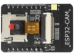 |   ESP32 Cam   |   1    |
|  2   | 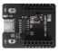 | CH340 adapter |   1    |
|  3   | 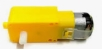 |   DC motor    |   2    |
|  4   | 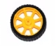 |     车轮      |   2    |
|  5   |                          |               |        |
|  6   |                          |               |        |
|  7   |                          |               |        |
|  8   |                          |               |        |


## **3. ESP32 Cam模块介绍：**

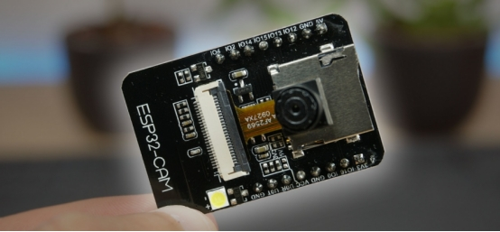

ESP32-CAM是一款小型摄像头模块，搭载ESP32-S芯片。ESP32-CAM可以用于各种物联网应用，包括拍摄高质量的静态图片和视频，还可以作为安全摄像头使用。  

ESP32-CAM非常适合低功耗应用，例如安全摄像头、无人机以及工业物联网应用。它可以通过5V或3.3V供电，并内置USB串口转换器，便于编程和调试。  

### ESP32-CAM特点：

\- 搭载ESP32-S模块，支持WiFi和蓝牙  

\- 配备OV2640摄像头及闪光灯  

\- 带有TF卡插槽，支持最大4G的TF卡数据存储  

\- 支持WiFi视频监控及WiFi图片上传  

\- 支持多种睡眠模式，深度睡眠电流低至6mA  

\- 控制接口通过引脚头提供，易于集成到用户产品中  

 

### ESP32-CAM应用场景：

该模块可以帮助我们开发具备视觉功能的项目，以下是一些典型应用：  

\- 智能家电图像上传

\- 无线监控  

\- 智能农业  

\- 无线QR标签  

\- 人脸识别  

\- 安全摄像头  

\- 长时间延时拍摄  

\- 3D打印机监控摄像头  

\- 门铃摄像头  

\- 等等  

### ESP32-CAM pinout：

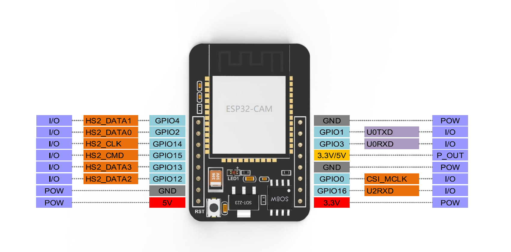

 GPIO 1和GPIO 3是串行引脚，您需要这些引脚才能将代码上传到您的电路板。此外，GPIO 0也起着重要作用，因为它确定ESP32-CAM是否处于下载模式。当ESP32-CAM下载复位前GPIO 0连接到GND就能进入，下载模式。

**以下引脚内部连接到microSD卡读卡器：**

GPIO 14：CLK
	GPIO 15：CMD
	GPIO 2：数据0
	GPIO 4：数据1（也连接到板载LED）
	GPIO 12：数据2
	GPIO 13：数据3

所以当我们使用SD卡读取功能时这些引脚将不可用。

### ESP32-CAM 原理图：

[点击下载原理图PDF](./esp32_cam_schematic_diagram.pdf)

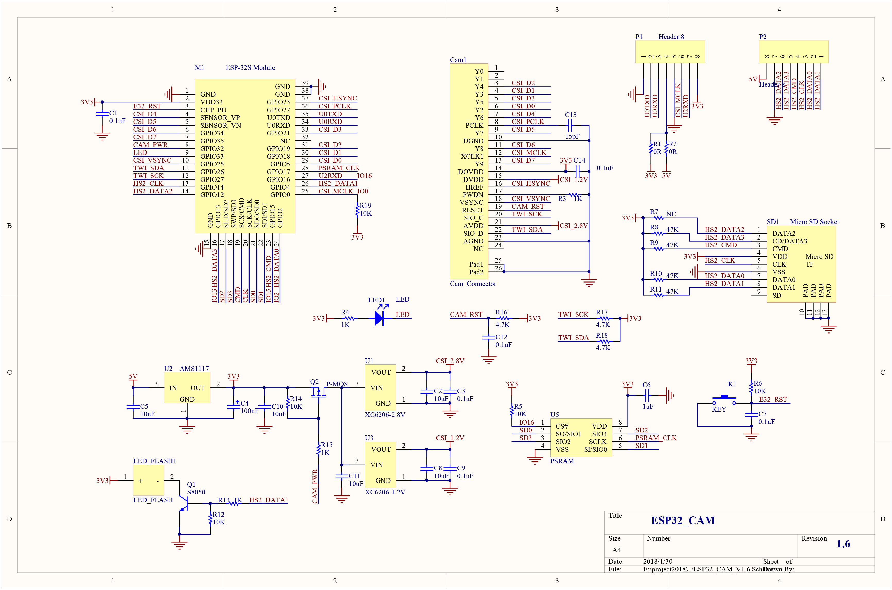

## 4. ESP32-CAM适配器底板

### 4.1 适配器底板简介

这是传统的ESP32-CAM下载代码的方式，使用一个串口模块然后通过杜邦线连接到ESP32-CAM板上，这种方式使用起来比较繁琐，先要通过杜邦线连接，然后要下载前将IO0连接到GND上，运行代码是又要将IO0断开与GND的连极。

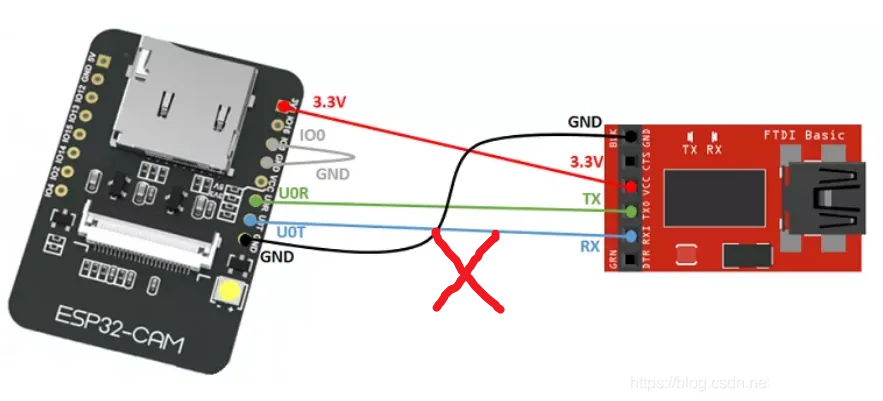

这是使用我们提供的ESP32-CAM适配器底板的下载方式，只需要将ESP32-CAM插入到排母中然后直接插上Type-c USB线连接到电脑即可下载

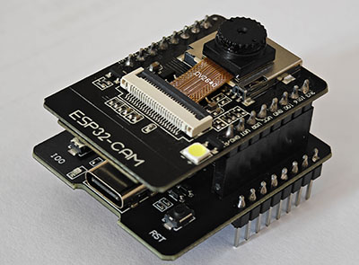


**底板介绍：**

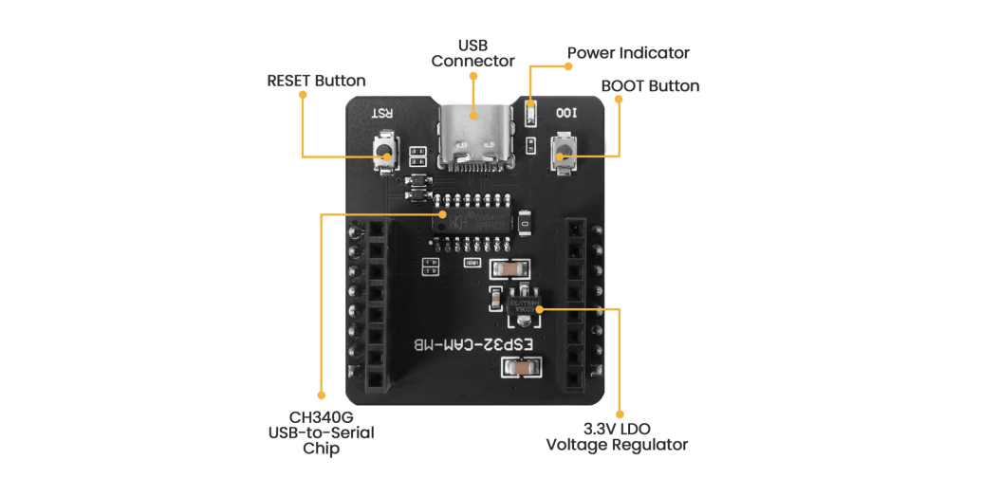

​          这块板的突出特点是配备了CH340 USB转串口转换器，它负责在电脑和ESP32-CAM之间进行数据传输。此外，它还包括一个重置按钮（RESET）、一个启动按钮（BOOT）、一个电源指示灯以及一个电压调节器，为ESP32-CAM提供充足的电力支持。

### 4.2 安装适配器底板 CH340 USB 驱动（重要）

安装驱动前需要将适配器底板使用USB线连接到电脑，USB驱动是必须安装的否则上传代码时你将找不到ESP32-CAM的端口号。

#### Windows：

Windows CH340驱动的获取方式，[点击此处下载](./Windows.zip)

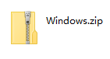

<p style="color:red;">注意：下载成功后解压并存放到你能找到的位置，最好是存放在桌面这样你能很容易的找到它</p>

windows 10及更高版本系统都是有自带驱动的，如果你是Windows 10或更高版本的系统可以进行查看

将编程盒连接电脑后，点击计算机--属性--设备管理器。如图，已经连接成功了就不需要再安装驱动了。

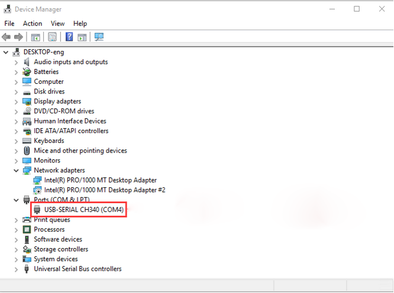

如果是这样的就需要手动安装驱动了

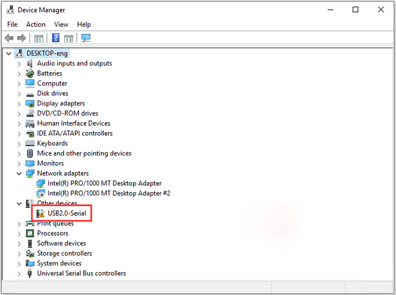

选择后右击，然后点击“更新驱动程序”，开始安装驱动，如下图。

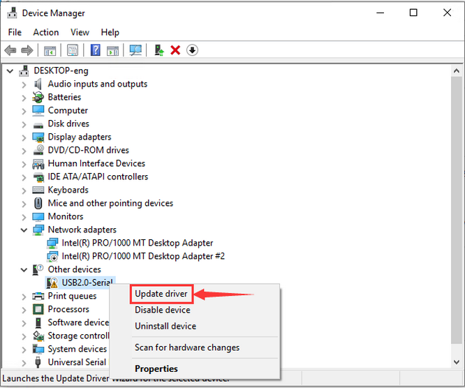

进入下图，选择浏览我的电脑以查找驱动程序。

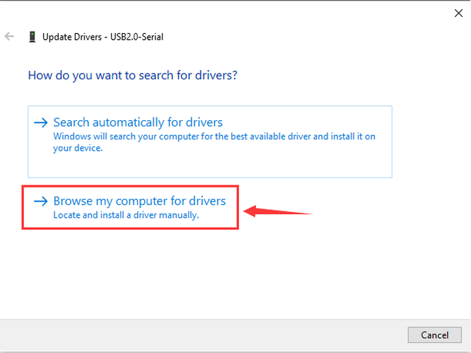

在电脑中找到下载好的驱动文件夹usb_ch341_3.1.2009.06 然后点击确认

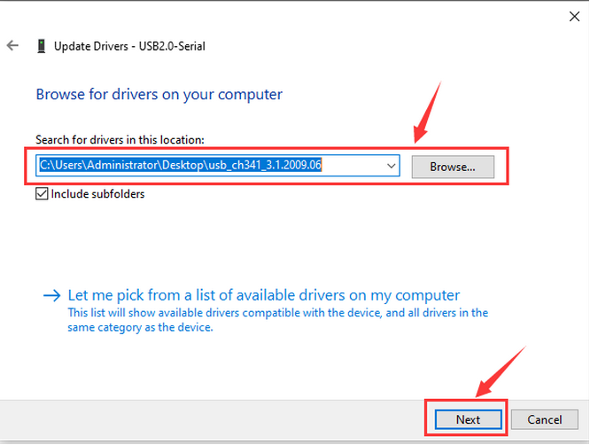

安装驱动完成，出现下图点击关闭，之后就会出现串口号了。

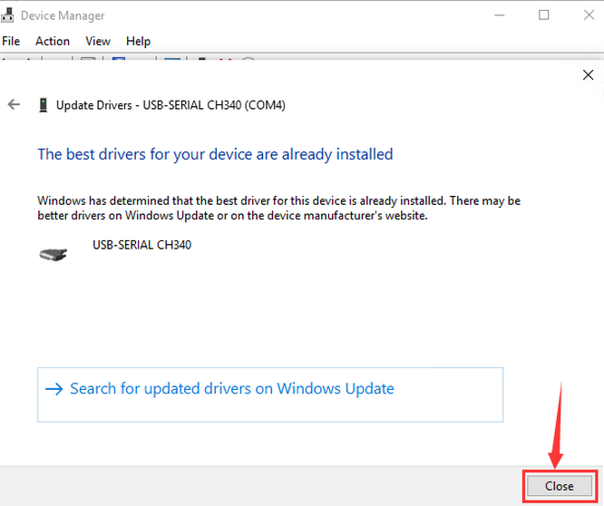

这样驱动就装好了。点击计算机--属性--设备管理器，我们可看见如下图。


#### MAC：

MAC CH340驱动的获取方式：[点击此处下载](./MAC.zip)

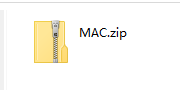

<p style="color:red;">注意：下载成功后解压并存放到你能找到的位置，最好是存放在桌面这样你能很容易的找到它</p>

Step 1: Download the driver from the Website and extract the file to the local installation directory.

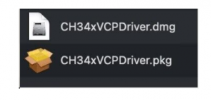

Step 2: For details about how to install the driver in pkg format by default, see Step 3. If OS X 11.0 or later does not support Rosetta, refer to Step 4 to install the dmg driver.

Before installation, please forward to “System Preferences”->“Security & Privacy”->“General” page, below the title “Allow apps downloaded from:” choose the choice 2->“Mac App Store and identified developers”, then the driver will work normally.

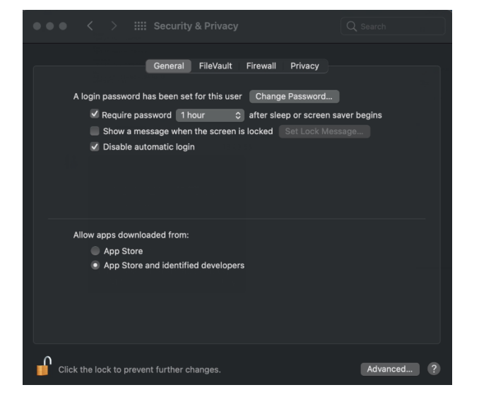

Step 3: To install the driver in pkg format, tap the driver file → Continue→ Install


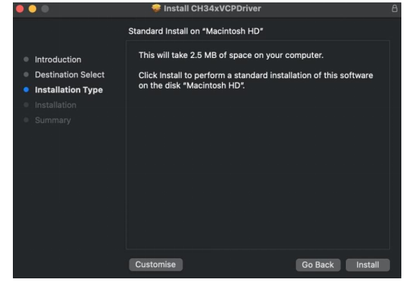

Then the installation will be successful


To install the pkg format driver on OS X 11.0 and later: Open “LaunchPad”→“CH34xVCPDriver”→Install

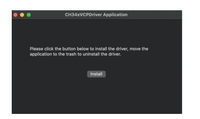

When using OS X 10.9 to OS X 10.15, click “Restart” to restart your computer, and perform the following steps after the restart.


Step 4: To install the dmg driver, tap the dmg file and drag “CH34xVCPDriver” to enter the application folder in the operating system.

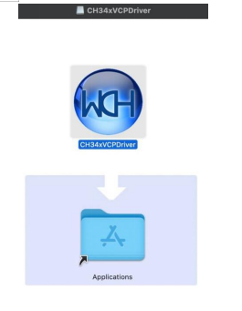

Then open “LaunchPad”→“CH34xVCPDriver”→Install

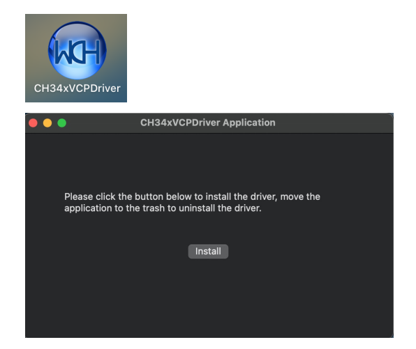

Then the installation will be successful


When inserting the CH340 control board into the USB port, open System Report -> Hardware ->USB. On the right is USB Device Tree. If the USB device is working properly, you will find a device whose “Vendor ID” is [0x1a86].


Open “Terminal” program under Applications-Utilities folder and type the command “ls /dev/tty*”.


You should see the “tty.wchusbserialx” where “x” is the assigned device number similar to Windows COM port assignment.

## **5. Arduino IDE下载以及安装使用**

### 5.1 Arduino IDE 简介

Arduino IDE是一款专为Arduino硬件设计的集成开发环境，它以初学者友好的界面和强大的开源代码支持而闻名。这款工具不仅简化了编程过程，降低了开发门槛，还为初学者提供了一个易于上手的学习平台。

Arduino IDE拥有简洁直观的用户界面，支持语法高亮、自动完成等功能，使得编程过程变得轻松愉快。更重要的是，它基于开放源代码，这意味着用户可以自由访问、修改和分发代码，从而大大扩展了开发的可能性。

对于初学者来说，Arduino IDE提供了丰富的教程、示例代码和社区支持，帮助他们快速上手并解决实际问题。同时，开源代码的特性也意味着用户可以借鉴和学习他人的代码，加速自己的学习进程。

总之，Arduino IDE以其初学者友好的界面和强大的开源代码支持，成为了Arduino开发者不可或缺的工具之一，无论是初学者还是专业人士，都能从中受益。

### 5.2 下载Arduino IDE并安装

#### **A. Windows 系统下载**

我们先到Arduino官方的网站：[https://www.arduino.cc/](https://www.arduino.cc/)

下载最新版本的arduino开发软件，进入网站之后点击界面上的SOFTWARE，如下图：


Arduino 软件有很多版本，有wodows,mac linux系统的（如下图），而且还有过去老的版本，你只需要下载一个适合系统的版本即可。


这里我们以Windows系统的为例给大家介绍下载和安装的步骤。Windows系统的也有两个版本，一个版本是安装版的，一个是下载版的不用安装，直接下载文件到电脑，解压缩就可以用了。


一般情况下，我们点击JUST DOWNLOAD就可以下载了，当然，如果你愿意，你可以选择小小的赞助一下，以帮助伟大的Arduino 开源事业。

#### **B. Mac 系统下载**

不同的系统，需要下载不同的Arduino IDE，下载方式和Windows类似。选择如下图。

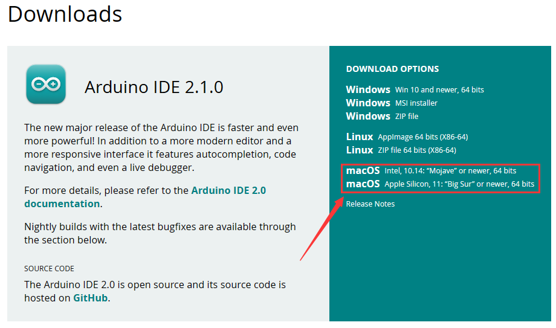

下载完成后直接双击，然后按照提示进行安装。

#### **C.安装步骤：**

1.Save the .exe file downloaded from the software page to your hard drive and simply run the file .


2.Read the License Agreement and agree it.


3.Choose the installation options.


4.Choose the install location.


5.Click finish and run Arduino IDE


### 5.3 安装ESP32 开发板

#### A.适用于下载网络好的Windows和MAC系统

我们发现在arduino IDE “Tools”的“Board”中找不到ESP32开发板的选项，这是因为我们没有添加ESP..32开发板，接下来我们一起来为Arduino IDE添加ESP32开发板吧!


安装ESP32开发板步骤如下：

首先打开Arduino IDE

点击“**File** ——>**Preferences**”，在Additional boards manager URLs中，添加ESP32开发板链接：https://espressif.github.io/arduino-esp32/package_esp32_index.json

再点击OK。

-1682391415970-35.png)

点击左边的开发板小图标，打开开发板选项。

-1682391426145-37.png)

在开发板搜索框中，搜索ESP32，点击`2.0.12`版本，右下角可以看到开发板安装进度，等待几分钟安装完成。**安装过程中请保持网络稳定，如安装失败，请重复以上步骤，重新安装开发板即可。**

注意：因为我们开发是使用的是ESP32 2.0.12 版本，请尽量保持一致，以免出现版本冲突。

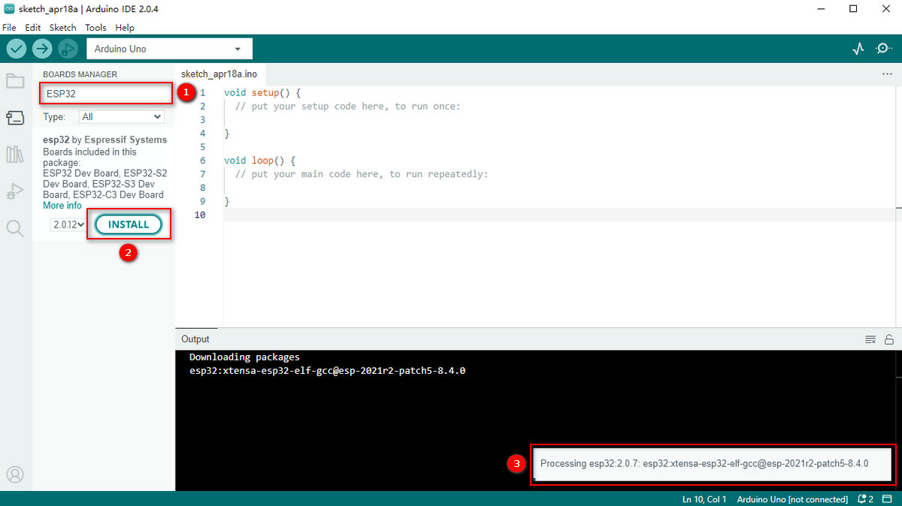

安装成功后便能在`Tools`中看到ESP32开发板了

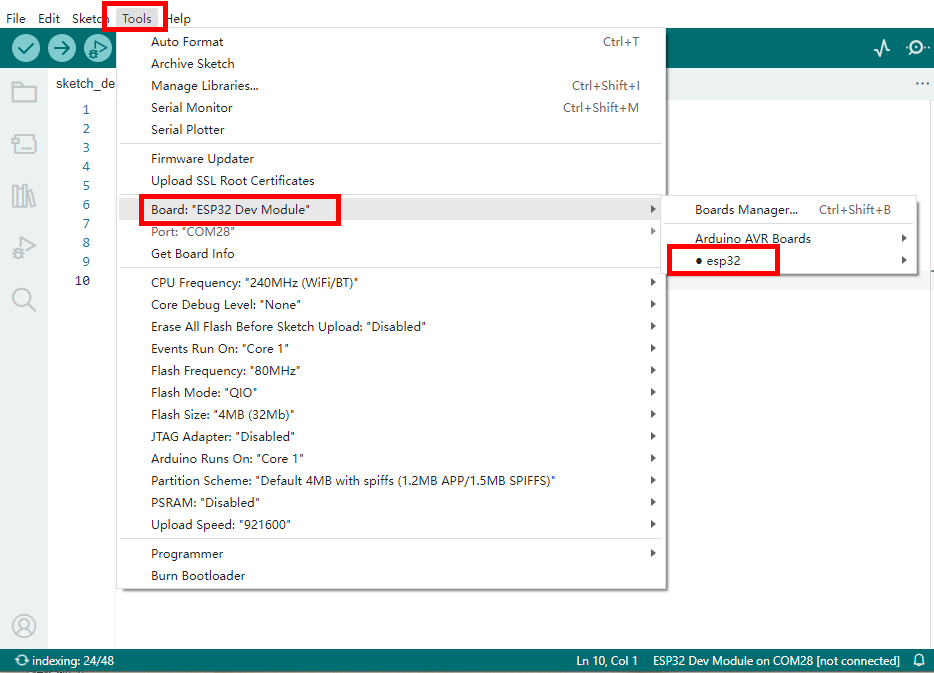

#### B.适用于Windows系统，优势是安装快速可传递使用

`ESP32 2.0.12`这里提供了一个离线包，直接下载这个离线包，等你安装好Arduino IDE后点击运行这个离线包则会自动为Arduino IDE安装`ESP32 2.0.12`版：[点击下载ESP32 2.0.12离线包](https://fs.keyestudio.com/ESP32)

下载完成后关闭Arduino IDE 然后运行这个.exe文件，等待安装完成再打开Arduino IDE就能看见ESP32开发板了。（这个文件可能会被杀毒软件误认为病毒，请放心使用）

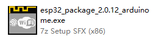


然后便能在`Tools`中看到ESP32开发板了


### 5.4 Arduino IDE使用

Clickicon，and open Arduino IDE.


1. “File”列表里面的功能有新建项目，打开程序，打开最近使用的代码，打开示例代码，关闭IDE，保存代码，首选项，高级设置等。
2. “Edit”列表里面的功能有复制，粘贴，自动格式化，字体大小等这个一般都是使用快捷键进行操作。（建议坚持使用快捷键，接触多了就水到渠成了）
3. “Sketch”列明里面的常用功能有验证\编译代码，上传代码，导入库等。
4. “Tools”列表里面的常用功能有开发板选择，端口选择，这两个很重要
5. “Help”点击这个可以查看IDE版本已经官方的参考文件
6. “串口绘图仪”它会将串口的数据以折线图的样式显示出来
7. “串口监视器”可以将我们需要查看的数据在这里进行打印显示
8. 验证程序按钮
9. 验证并上传程序按钮
10. “项目文件夹”可以新建项目，还可以只有arduino Cloud进行同步和编辑
11. “开发板管理器”可以添加或删除开发板
12. “库管理”就要添加和删除库
13. “调试”可以对代码进行监视与断点调试
14. 搜索框
15. 代码编辑区
16. IDE提示区（上传代码报错或成功）和串口监视器显示区

### 5.5 使用Arduino IDE下载第一个程序

点击`Tools`–>`Board:"xxxxxx"`–>`esp32`–>往下滑动并找到`AI Thnker ESP2-CAM`

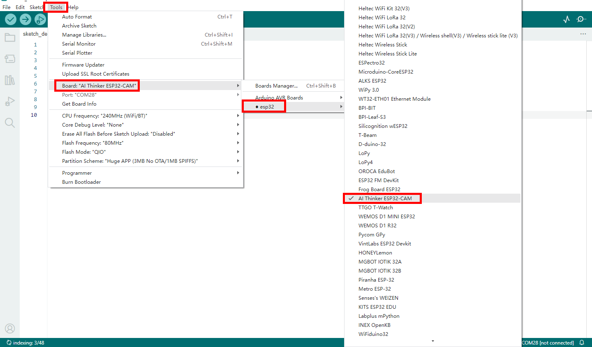

选好开发板后，选择开发板的COM口，开发板安装完驱动后会显示一个COM端口，如何你不知道你是哪个，可以进入你电脑的设备管理器中进行查看，如下图：（如果你有很多COM端口你不知道是哪个就可以拔掉开发板看哪个消失了，然后再插上开发板消失的COM口又会显示出来，如果没有COM就请检查是否有安装开发板驱动）

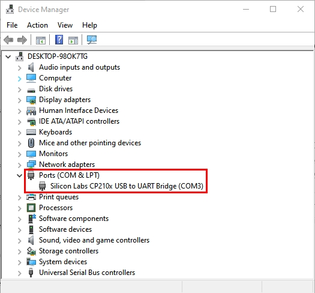


从图中可知我们的COM端口是COM3，我们在“Tools”列表中选择“Port”然后选择“COM3”

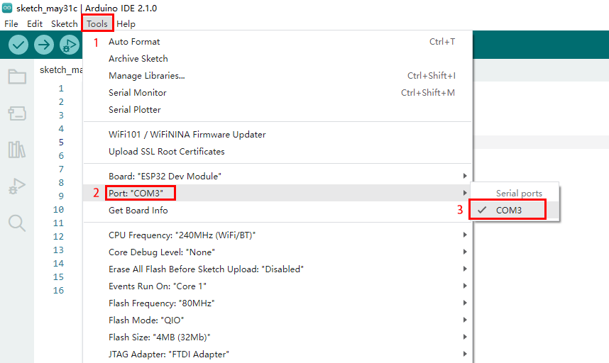

连接上开发板后，这两个地方都会显示已连接的标志

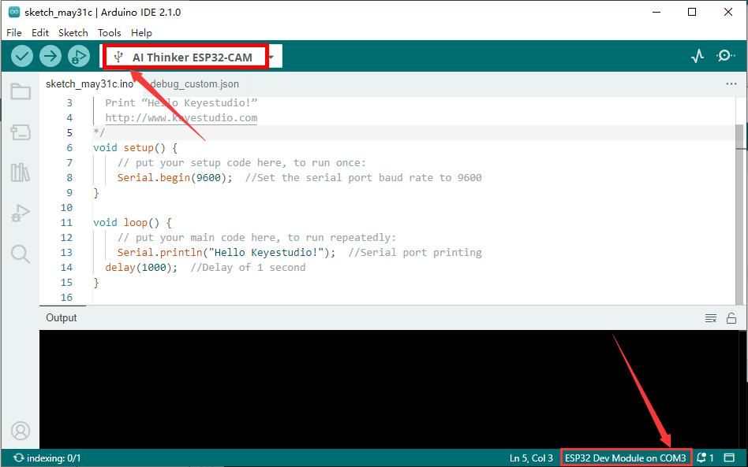

然后添加代码：这里我们提供一个示例代码，代码功能是在串口监视器中每隔一秒钟打印一次“Hello Keyestudio!”

将下面的代码复制粘贴到arduino IDE的代码区

```c
/*
  keyestudio 
  Print “Hello Keyestudio!”
  http://www.keyestudio.com
*/
void setup() {  
    // put your setup code here, to run once:
    Serial.begin(9600);  //Set the serial port baud rate to 9600
}

void loop() {  
    // put your main code here, to run repeatedly:
    Serial.println("Hello Keyestudio!");  //Serial port printing
 	delay(1000);  //Delay of 1 second
}
```


然后我们点击编译并上传代码，上传成功后IDE也会有两个提示，如图：

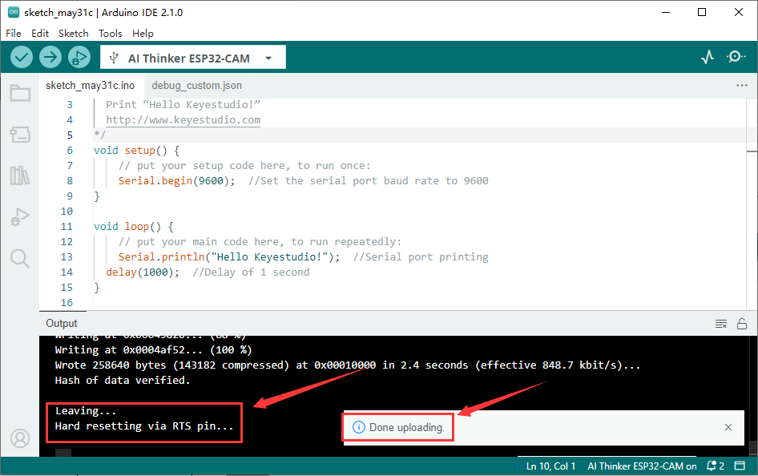

等待下载完成然后我们点击“串口监视器”图标便能打开串口监视器，然后设置波特率为9600，就能看到串口打印字符串“Hello Keyestudio!”

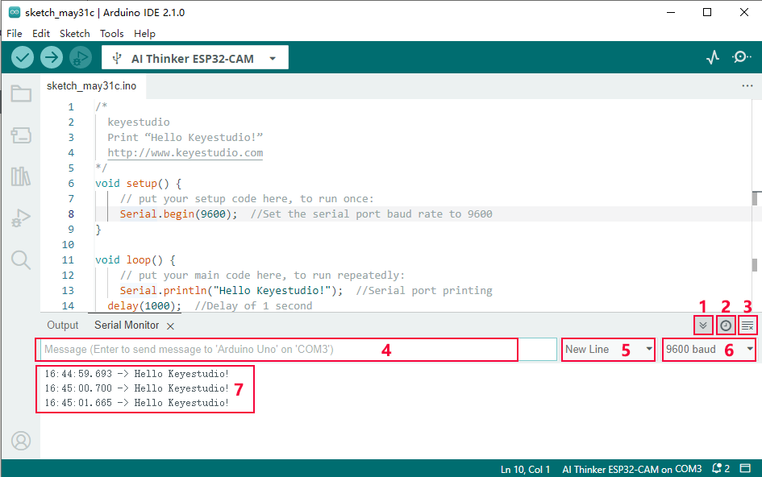

1. “Toggle Autoscroll”设置打印窗口是否跟随打印
2. “Toggle Timestamp ”设置是否显示打印时间
3. “Clear Output”清除打印窗口中的数据
4. 串口输入框
5. 串口发送格式
6. 设置波特率，点击即可选择需要的波特率
7. 打印窗口


### 5.6给Arduino IDE安装库文件

#### 5.6.1 什么是库文件

库是代码的集合，使您可以轻松地连接到传感器、显示器、模块等。

例如，内置的LiquidCrystal库使与字符LCD显示器的通话变得容易，Internet上有数百个其他库可供下载。参考中列出了内置库和手动添加的库。 

在编译代码或上传代码时如果出现报错“No such file or directory”那就是缺少库文件，如下图就是上传LCD1602模块代码时因为缺少了LiquidCrystal_I2C库文件的报错。


#### 5.6.2 如何安装库文件

我们以添加LiquidCrystal_I2C库文件为例。

  在这里，我们将为您介绍最简单的添加库的方法。首先，依次点击右上角的**Skerch>Include Library>Add .Zip Library...**


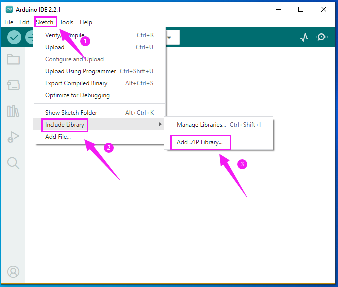

再选择文件中，找到自己需要的库压缩包.zip格式，点击确定即可添加成功，添加成功后消息栏会显示“**Library installed**”。

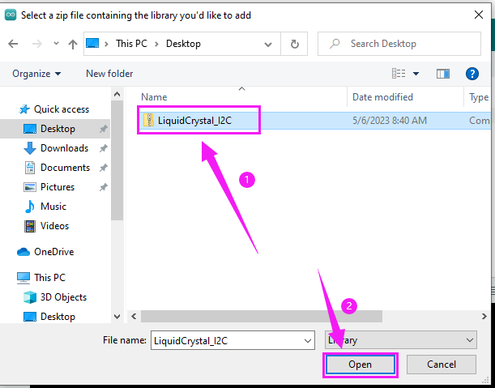

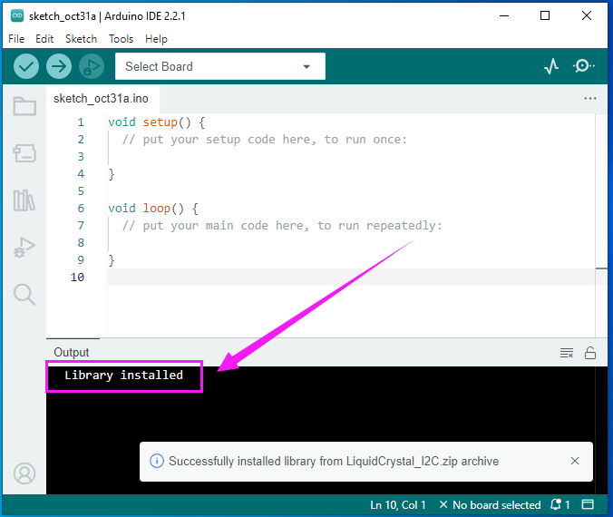

**动态操作示例：**


MAC和WINDOWS添加方法一致。

## 6. Arduino IDE基础代码介绍

#### 6.1 Arduino IDE 的开发语言

Arduino使用C/C++编写程序，虽然C++兼容C语言，但这是两种语言，C语言是一种面向过程的编程语言，C++是一种面向对象的编程语言。早期的Arduino核心库使用C语言编写，后来引进了面向对象的思想，目前最新的Arduino核心库采用C与C++混合编写而成。

通常所说的Arduino语言，就是指Arduino核心库提供的各种API的集合。这些API是对更底层的单片机支持库进行二次封装所形成的（玩过单片机的人估计都是经常和各种寄存器打交道）。Arduino提供的API可以让初学者不用理会单片机复杂寄存器配置，然后就能直观控制Arduino，提高开发效率。

#### 6.2 程序结构

arduino包括两个主要函数：

`void setup(){}` 当代码开始运行时，将调用setup（）函数。使用它来初始化变量、引脚模式、开始使用库等。setup（）函数只会在Arduino板每次通电或重置后运行一次。 

`void loop(){}` 相当于死循环while(1){}。 当然，可以自定义函数，并在以上两个函数中被调用。注意，setup函数和loop函数是必不可少的，否则会报错。

#### 6.3 基础语句

##### 1. delay(value) ;

delay() 延时函数，用于程序中需要等待的地方  语句： `delay(value)`

**value**： 延时时间数值(单位是ms)， 1S = 1000mS  ， 1mS = 1000 uS ，一般我们使用的mS

##### 2. digitalWrite(Pin,State);

digitalWrite() 函数用于控制指定引脚输出高电平（HIGH）或低电平（LOW） 语句：`digitalWrite(pin, value)`

- **pin**： the Arduino pin number
- **value**：HIGH or LOW

##### 3. digitalRead(Pin)

digitalRead(Pin);用于读取数字引脚的TTL电平，高电平（1），低电平（0） 语句：`digitalRead(Pin);`

**Pin:**需要读取的数字引脚

##### 4. analogWrite(Pin,Vlaue)

analogWrite() 函数将模拟值（PWM波）输出。可用于以不同的亮度点亮LED或以不同的速度驱动电机。在调用analogWrite（）后，该引脚将生成指定占空比的稳定矩形波，直到下一次在同一引脚上调用analogWrite（）（或调用digitalRead（）或digitalWrite（））。 语句：`analogWrite(pin, value)`

- **pin:** the Arduino pin to write to. Allowed data types:int
- **value:** the duty cycle: between 0 (always off) and 255 (always on). Allowed data types:int

##### 5. analogRead(Pin)

前面我们学了读取数字信号的函数，而analogRead(); 是读取模拟信号的函数,ESP32-CAM模拟值范围是0-4095  语句： `analogRead(Pin);`

**Pin:**读取模拟值的引脚号

##### 6. pinMode(Pin,mode)

pinMode() 用于将指定的引脚设置成输入或输出或上拉  语法；`pinMode(pin, mode)`

- **pin**: the Arduino pin number to set the mode of.
- **mode**:INPUT,OUTPUT, orINPUT_PULLUP

1. `int` 用于声明整形变量，如`int i = 0;`就是声明了一个整形的变量，变量名为i值为0；整形可以理解成整数的意思
2. `char` 用于声明字符变量，如`chat ch = ‘A’`就是声明了一个字符变量，变量名为ch值为‘A’

##### 7. if(){...}else{}

if() 用于判断条件是否满足如果条件满足则执行 “{ }”中的代码，如果条件不满足则不执行

else 是否则的条件，当if的判断表达式不成立时则执行else “{ }”中的代码

##### 8. for()

`for`语句是一种基本的循环控制结构，它允许你重复执行一段代码块固定的次数。`for`语句特别适用于已知循环次数的场景。

`for`语句的基本结构

```c
for (初始化表达式; 条件表达式; 迭代表达式) {  
    // 循环体：要重复执行的代码块  
}
```

- **初始化表达式**：在循环开始前执行，通常用于初始化一个或多个循环控制变量。
- **条件表达式**：在每次循环迭代前检查。如果条件为真（非零），则执行循环体；如果为假（零），则退出循环。
- **迭代表达式**：在每次循环迭代结束时执行，通常用于更新循环控制变量。

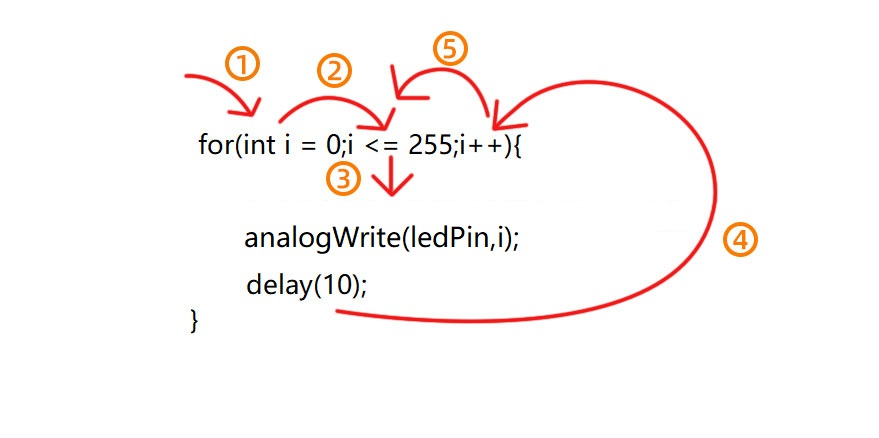

①：设置循环初始值，只是执行一遍，执行后进入②

②： 判断是否瞒住循环条件，如图中`i <= 255`则是i小于等于255就能进入循环代码③中

③： 循环代码，将需要循环的代码放到这里，如我们这个代码是需要控制pwm值从0到255所以我们只需将i的值当初pwm值即可然后进入④

④： i++ 是i在原来的值上再加一的操作等于 i = i +1 （i- -则是等效 i = i - 1），执行完后进入⑤

⑤： i的值加一（或减一）后接着判断i的值是否小于等于255，如果是则继续进入循环代码③，如果不是则退出for循环

##### 9. while(condition){…}

while循环将连续无限循环，直到括号（）内的表达式变为false。必须更改测试变量，否则while循环将永远不会退出。这可能是在你的代码中，比如一个递增的变量，也可能是一个外部条件，比如测试传感器。

##### 10. “>,<,<=,>=,==,!=”比较运算符

请注意，您可能会比较不同数据类型的变量，但这可能会产生不可预测的结果，因此建议比较相同数据类型（包括有符号/无符号类型）的变量。

10.1 `>`将左侧的变量与运算符右侧的值或变量进行比较。当左侧的操作数大于右侧的操作数时，返回true，否则返回false。

​	语法：

```c++
x > y; // is true if x is bigger than y and it is false if x is equal or smaller than y
```


10.2 `>=`将左侧的变量与运算符右侧的值或变量进行比较。当左侧的操作数大于或等于右侧的操作数时，返回true，否则返回false。

语法：

```c++
x >= y; // is true if x is bigger than or equal to y and it is false if x is smaller than y
```


10.3 `<`将左侧的变量与运算符右侧的值或变量进行比较。当左侧的操作数小于右侧的操作数时，返回true，否则返回false。

语法：

```c++
x < y; // is true if x is smaller than y and it is false if x is equal or bigger than y
```


4 `<=`将左侧的变量与运算符右侧的值或变量进行比较。当左侧的操作数小于或等于右侧的操作数时，返回true，否则返回false。

语法：

```c++
x <= y; // is true if x is smaller than or equal to y and it is false if x is greater than y
```


10.5 `==`将左侧的变量与运算符右侧的值或变量进行比较。当两个操作数相等时，返回true，否则返回false。(注意判断两个值是否相等是“==”)

语法：

```c++
x == y; // is true if x is equal to y and it is false if x is not equal to y
```


`!=`将左侧的变量与运算符右侧的值或变量进行比较。当两个操作数不相等时，返回true，否则返回false。

语法：

```c++
x != y; // is false if x is equal to y and it is true if x is not equal to y
```


##### 11. “+,-,*,/,%,=”算数运算符

11.1 `+`加法是四种主要算术运算之一。运算符+（加号）对两个操作数进行运算以产生总和。

​	语法：`sum = operand1 + operand2;`

11.2 `-`减法是四种主要算术运算之一。运算符-（减号）对两个操作数进行运算，以产生第二个操作数与第一个操作数的差值。

​	语法：`difference = operand1 - operand2;`

11.3 `*`乘法是四种主要算术运算之一。运算符“*”（星号）对两个操作数进行运算以产生乘积。

​	语法：`product = operand1 * operand2;`

11.4 `/`除法是四种主要算术运算之一。运算符“/”（斜线）对两个操作数进行操作以产生结果。

​	语法：`result = numerator / denominator;`

11.5 `%`余数运算计算一个整数除以另一个整数时的余数。它有助于将变量保持在特定范围内（例如数组的大小）。“%”（百分比）符号用于执行余数运算。

​	 语法：`remainder = dividend % divisor;`

11.6 `=`在C++编程语言中，单个等号“=”被称为赋值运算符。它与代数课中表示方程或等式的意义不同。赋值运算符告诉微控制器评估等号右侧的任何值或表达式，并将其存储在等号左侧的变量中。

示例：

```c++
int sensVal;              // declare an integer variable named sensVal
    sensVal = analogRead(0);  // store the (digitized) input voltage at analog pin 0 in SensVal
```


##### 12. “||,&&，!”布尔运算符

12.1 `||`如果两个操作数中的任何一个为真，则逻辑OR的结果为真。

​	示例：

```c++
if (x > 0 || y > 0) { // if either x or y is greater than zero
      // statements
    }
```

12.2 `&&`只有当两个操作数都为真时，逻辑AND的结果才为真。

​	示例：

```c++
if (digitalRead(2) == HIGH && digitalRead(3) == HIGH) { // if BOTH the switches read HIGH
      // statements
    }
```


##### 13. #include

#include用于在草图中包含外部库。这使程序员可以访问大量标准C库（预制函数组），以及专门为Arduino编写的库。

​	语法：`#include <LibraryFile.h>` 或 `#include "LocalFile.h"`

##### 14. #define

 #define 用于设置常量（值不变得量叫常量）  语法：`#define constantName value`

- **constantName:** the name of the macro to define
- **value:** the value to assign to the macro

##### 15. Serial.begin(9600)

Serial.begin(9600);设置串口波特率，只有设置了串口波特率并且与串口打印工具保持一样的波特率才能进行串口打印。一般常用9600与115200

##### 16. Serial.print()

Serial.print(); 串口不换行打印函数，打印时执行将变量或者需要打印的字符输入到括号中（打印字符需要放到双引号中）

##### 17. Serial.println()

Serial.println(); 串口换行打印函数，打印时执行将变量或者需要打印的字符输入到括号中（打印字符需要放到双引号中）


更多详细解释请参考官方链接：[Language Reference | Arduino Documentation](https://docs.arduino.cc/language-reference/#variables)


## 7. 板载LED灯

### 7.1 板载LED灯简介

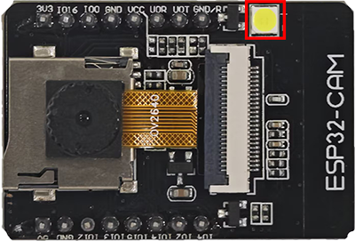

从外观中我们便能看到，ESP32-CAM板载了一个LED灯，那么我们该如何点亮这个LED灯呢？从ESP32-CAM原理图中可查看到LED的控制引脚，如下图：

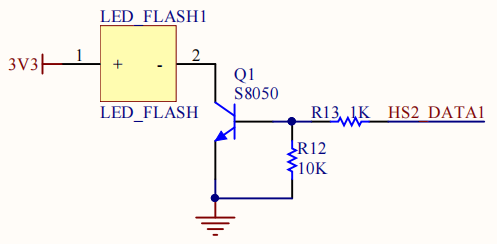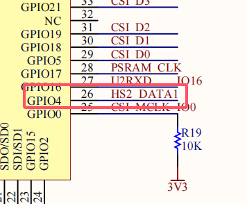

从图中得知LED的控制引脚为GPIO4，接下来我们简单介绍一下这个电路是如何控制LED灯点亮和熄灭的。可以看到LED的正极直接连接到了3.3V，而LED的负极则是使用了一个三极管控制LED负极是否连接到GND，当GPIO4脚输出高电平时三极管控制LED负极连接到GND，反之GPIO4输出低电平三极管断开LED负极到GND的连接。这样就实现了LED的控制，至于为什么要添加一个三极管来控制LED的亮灭，这是因为GPIO输出的电流是有限的不能实现大电流控制。

### 7.2 LED闪烁

接下来我们使用代码控制LED亮500ms然后灭500ms，然后一直这样循环就实现了LED闪烁了。

```c++
/*
  项目名称: LED控制
  作者: Keyestudio
  描述: 介绍如何控制LED灯的亮灭。
*/
int ledPin = 4; //定义变量ledPin为GPIO4脚
void setup() {
  // put your setup code here, to run once:
  pinMode(ledPin,OUTPUT); //设置GPIO4脚为输出模式
}

void loop() {
  // put your main code here, to run repeatedly:
  digitalWrite(ledPin,HIGH);  //控制GPIO4脚输出高电平
  delay(500); //延时500ms
  digitalWrite(ledPin,LOW); //控制GPIO4输出低电平
  delay(500); //延时500ms
}

```

### 7.3 呼吸灯

学会了如何控制LED的亮灭，那么如果我们想控制LED灯的亮度呢？下面我们看看该如何控制LED的亮度，这里我们需要使用一个叫PWM的东西。

**什么是PWM?**

脉冲宽度调制（Pulse width modulation），是一种使用数字信号模拟出模拟信号变化的方案。

何为脉冲宽度，就是指一个完整的方波周期中，占据高电平的那部分，所以顾名思义，脉冲宽度调制就是调节方波中高电平的部分（当然，换个角度来说，也调节了低电平的部分。因为周期时间一定，高电平的时间改变了，低电平的时间也改变了）。

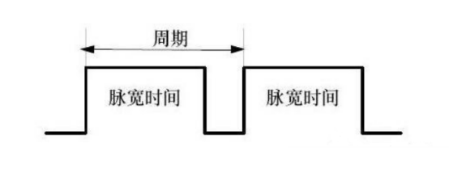

- PWM的频率

  是指1秒钟内信号从高电平到低电平再回到高电平的次数(一个周期)，也就是说一秒钟PWM有多少个周期。

  单位 ：Hz

  表示方式 ： 50Hz 100Hz

- PWM的周期

  $ T= \frac {1}{f}$      $ 周期= \frac {1}{频率}$

  如果频率为50Hz，也就是说一个周期是20ms，那么一秒钟就有 50次PWM周期。

- PWM的占空比

  是指一个脉冲周期内，高电平的时间与整个周期时间的比例。

  - 单位 ：%（1% ~ 100%）


  - 周期 ：一个脉冲信号的时间。1s内测周期次数等于频率。
  - 脉宽时间 ：高电平时间

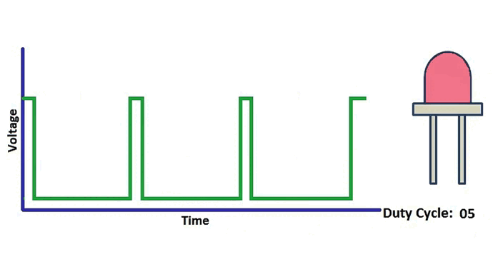

<center>占空比与LED灯亮度的关系.gif<center>
可以看出，高电平的时间越多，占空比越大，LED灯也越亮。

PWM使用语句`analogWrite(Pin,Value)`进行输出，Pin是PWM输出的引脚，Value是PWM的值（范围是：0-255）

​    **呼吸灯代码：**

上传代码实现led灯慢慢的由暗变亮，然后在由亮变暗效果。

实现思路：使用analogWrite(Pin,Value)进行输出PWM，然后使用for循环对PWM值进行加1和减1，这样就能使PWM输出的值从0到255然后在由255到0

```c++
/*
  项目名称: 呼吸灯
  作者: Keyestudio
  描述: 介绍如何控制LED灯的亮度。
*/
int ledPin = 4;  //定义变量ledPin为GPIO4脚
void setup() {
  // put your setup code here, to run once:
  pinMode(ledPin, OUTPUT);  //设置GPIO4脚为输出模式
}

void loop() {
  // put your main code here, to run repeatedly:
  for (int i = 0; i <= 255; i++) {  //循环将i的值从0加到255
    analogWrite(ledPin, i); //GPIO4以PWM形式输出，并且设置PWM值为i
    delay(10);  //延时10ms
  }
  for (int i = 255; i >= 0; i--) {  //循环将i的值从255减到0
    analogWrite(ledPin, i); //GPIO4以PWM形式输出，并且设置PWM值为i
    delay(10);
  }
}

```


## 8. 小车组装


## 9. L298N模块

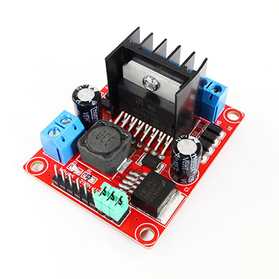

### 9.1 L298N 简介

L298电机驱动模块由意法半导体（ST Semiconductor）集团生产，是一种双路全桥式电机驱动芯片。它通常被用来驱动继电器、螺线管、电磁阀、直流电机以及步进电机。L298N（N是L298的封装标识符）可以驱动一台两相步进电机或四相步进电机，也可以驱动两台直流电机。

### 9.2 L298N模块参数

- 驱动部分端子供电范围VDD：5V~35V
- 驱动部分峰值电流Io：2A
- 逻辑部分端子供电：5V
- 逻辑部分工作电流范围：0~36mA
- 控制信号输入电压范围：低电平（-0.3VsVin≤1.5V），高电平（2.3VsVinsVss）
- 使能信号输入电压范围：低电平（-0.3svin≤1.5V，控制信号无效），高电平（2.3VsvinsVss，控制信号有效）

### 9.2 L298N Pinout

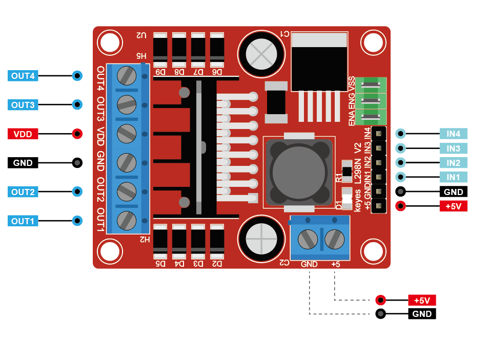

### 9.3 电路连接

为了给车供电，我们将使用9v电池，并按照以下方式连接：

\- 电池正极连接到L298N的+VDD

\- 电池负极连接到L298N的GND

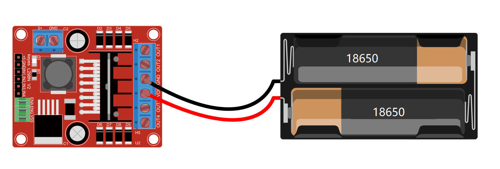 

为了给ESP32-CAM模块供电，我们将使用L298N的+5V输出作为电源，具体操作如下：  

\- 将L298N上的电源跳线插好

 \- L298N的+5V连接ESP32-CAM的5V

 \- L298N的GND连接ESP32-CAM的GND

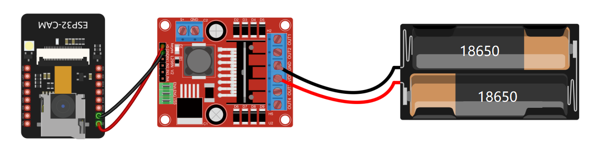 

 ESP32-CAM和 L298N之前的信号连接，具体操作如下：  

\- L298N的IN1连接ESP32-CAM的GPIO 14  

 \- L298N的IN2连接ESP32-CAM的GPIO 15  

 \- L298N的IN3连接ESP32-CAM的GPIO 13  

 \- L298N的IN4连接ESP32-CAM的GPIO 12  

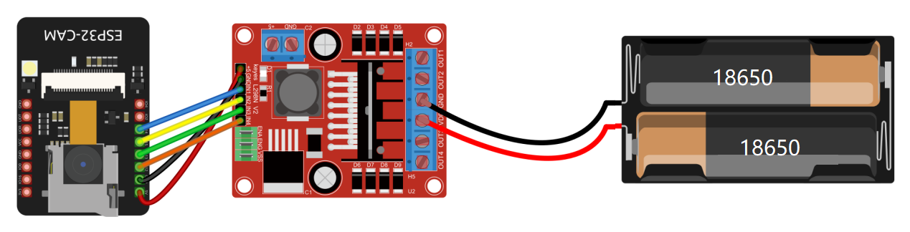 

由于我们不会控制车速，车将以最大速度运行，因此将ENA和ENB跳线插好即可。

完整的电路连接如下：  

|     功能描述     | ESP32-CAM | 电机驱动板 | 左边电机 | 右边电机 |
| :--------------: | :-------: | :--------: | :------: | :------: |
| 右边电机控制引脚 |  GPIO14   |    IN1     |          |          |
| 右边电机控制引脚 |  GPIO15   |    IN2     |          |          |
| 左边电机控制引脚 |  GPIO13   |    IN3     |          |          |
| 左边电机控制引脚 |  GPIO12   |    IN4     |          |          |
| ESP32-CAM供电 +  |    5V     |     5V     |          |          |
| ESP32-CAM供电 -  |    GND    |    GND     |          |          |
| 右边电机输出引脚 |           |    OUT1    |          |  黑色线  |
| 右边电机输出引脚 |           |    OUT2    |          |  红色线  |
| 左边电机输出引脚 |           |    OUT3    |  黑色线  |          |
| 左边电机输出引脚 |           |    OUT4    |  红色线  |          |
|                  |           |            |          |          |
|                  |           |            |          |          |

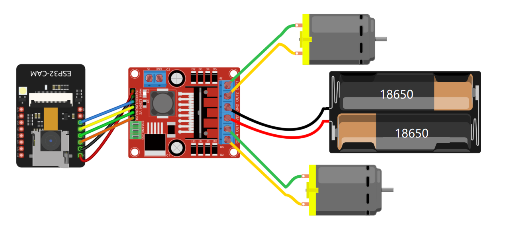 

### 9.4 电机驱动逻辑

我们以小车为参照物，左右电机转动方向是使小车前进的那就视为正转，如果是小车后退的就视为反转。

GPIO12与GPIO13控制小车左边电机 ， GPIO13与GPIO14控制小车右边电机 

| 小车状态 | GPIO12(L) | GPIO13(L) | GPIO14(R) | GPIO15(R) | 左边电机 | 右边电机 |
| :------: | :-------: | :-------: | :-------: | :-------: | :------: | :------: |
|   前进   |    LOW    |   HIGH    |    LOW    |   HIGH    |   正转   |   正转   |
|   后退   |   HIGH    |    LOW    |   HIGH    |    LOW    |   反转   |   反转   |
|   左转   |   HIGH    |    LOW    |    LOW    |   HIGH    |   反转   |   正转   |
|   右转   |    LOW    |   HIGH    |   HIGH    |    LOW    |   正转   |   反转   |
|   停止   |    LOW    |    LOW    |    LOW    |    LOW    |   停止   |   停止   |


## 9. 示例代码：

 

```c++
#include "esp_camera.h"

#include <WiFi.h>

#include "esp_timer.h"

#include "img_converters.h"

#include "Arduino.h"

#include "fb_gfx.h"

#include "soc/soc.h"       // disable brownout problems

#include "soc/rtc_cntl_reg.h"   // disable brownout problems

#include "esp_http_server.h"

// Replace with your network credentials

const char* ssid = "your WIFI name";

const char* password = "your WIFI password";

#define PART_BOUNDARY "123456789000000000000987654321"

#define CAMERA_MODEL_AI_THINKER

//#define CAMERA_MODEL_M5STACK_PSRAM

//#define CAMERA_MODEL_M5STACK_WITHOUT_PSRAM

//#define CAMERA_MODEL_M5STACK_PSRAM_B

//#define CAMERA_MODEL_WROVER_KIT

#if defined(CAMERA_MODEL_WROVER_KIT)

 #define PWDN_GPIO_NUM   -1

 #define RESET_GPIO_NUM  -1

 #define XCLK_GPIO_NUM   21

 #define SIOD_GPIO_NUM   26

 #define SIOC_GPIO_NUM   27

 

 \#define Y9_GPIO_NUM    35

 \#define Y8_GPIO_NUM    34

 \#define Y7_GPIO_NUM    39

 \#define Y6_GPIO_NUM    36

 \#define Y5_GPIO_NUM    19

 \#define Y4_GPIO_NUM    18

 \#define Y3_GPIO_NUM    5

 \#define Y2_GPIO_NUM    4

 \#define VSYNC_GPIO_NUM  25

 \#define HREF_GPIO_NUM   23

 \#define PCLK_GPIO_NUM   22

\#elif defined(CAMERA_MODEL_M5STACK_PSRAM)

 \#define PWDN_GPIO_NUM   -1

 \#define RESET_GPIO_NUM   15

 \#define XCLK_GPIO_NUM   27

 \#define SIOD_GPIO_NUM   25

 \#define SIOC_GPIO_NUM   23

 

 \#define Y9_GPIO_NUM    19

 \#define Y8_GPIO_NUM    36

 \#define Y7_GPIO_NUM    18

 \#define Y6_GPIO_NUM    39

 \#define Y5_GPIO_NUM     5

 \#define Y4_GPIO_NUM    34

 \#define Y3_GPIO_NUM    35

 \#define Y2_GPIO_NUM    32

 \#define VSYNC_GPIO_NUM   22

 \#define HREF_GPIO_NUM   26

 \#define PCLK_GPIO_NUM   21

\#elif defined(CAMERA_MODEL_M5STACK_WITHOUT_PSRAM)

 \#define PWDN_GPIO_NUM   -1

 \#define RESET_GPIO_NUM   15

 \#define XCLK_GPIO_NUM   27

 \#define SIOD_GPIO_NUM   25

 \#define SIOC_GPIO_NUM   23

 \#define Y9_GPIO_NUM    19

 \#define Y8_GPIO_NUM    36

 \#define Y7_GPIO_NUM    18

 \#define Y6_GPIO_NUM    39

 \#define Y5_GPIO_NUM     5

 \#define Y4_GPIO_NUM    34

 \#define Y3_GPIO_NUM    35

 \#define Y2_GPIO_NUM    17

 \#define VSYNC_GPIO_NUM   22

 \#define HREF_GPIO_NUM   26

 \#define PCLK_GPIO_NUM   21

#elif defined(CAMERA_MODEL_AI_THINKER)

 #define PWDN_GPIO_NUM   32

 #define RESET_GPIO_NUM   -1

 #define XCLK_GPIO_NUM    0

 #define SIOD_GPIO_NUM   26

 #define SIOC_GPIO_NUM   27

 

 #define Y9_GPIO_NUM    35

 #define Y8_GPIO_NUM    34

 #define Y7_GPIO_NUM    39

 #define Y6_GPIO_NUM    36

 #define Y5_GPIO_NUM    21

 #define Y4_GPIO_NUM    19

 #define Y3_GPIO_NUM    18

 #define Y2_GPIO_NUM     5

 #define VSYNC_GPIO_NUM   25

 #define HREF_GPIO_NUM   23

#define PCLK_GPIO_NUM   22

#elif defined(CAMERA_MODEL_M5STACK_PSRAM_B)

 #define PWDN_GPIO_NUM   -1

 #define RESET_GPIO_NUM   15

 #define XCLK_GPIO_NUM   27

 #define SIOD_GPIO_NUM   22

 #define SIOC_GPIO_NUM   23

 #define Y9_GPIO_NUM    19

 #define Y8_GPIO_NUM    36

 #define Y7_GPIO_NUM    18

 #define Y6_GPIO_NUM    39

 #define Y5_GPIO_NUM     5

 #define Y4_GPIO_NUM    34

 #define Y3_GPIO_NUM    35

 #define Y2_GPIO_NUM    32

 #define VSYNC_GPIO_NUM   25

 #define HREF_GPIO_NUM   26

 #define PCLK_GPIO_NUM   21

#else

 #error "Camera model not selected"

#endif

#define MOTOR_1_PIN_1   12

#define MOTOR_1_PIN_2   13

#define MOTOR_2_PIN_1   15

#define MOTOR_2_PIN_2   14

static const char* _STREAM_CONTENT_TYPE = "multipart/x-mixed-replace;boundary=" PART_BOUNDARY;

static const char* _STREAM_BOUNDARY = "\r\n--" PART_BOUNDARY "\r\n";

static const char* _STREAM_PART = "Content-Type: image/jpeg\r\nContent-Length: %u\r\n\r\n";

httpd_handle_t camera_httpd = NULL;

httpd_handle_t stream_httpd = NULL;

static const char PROGMEM INDEX_HTML[] = R"rawliteral(

<html>

 <head>

  <title>ESP32-CAM Robot</title>

    <meta name="viewport" content="width=device-width, initial-scale=1">

    <style>

   body { font-family: Arial; text-align: center; margin:0px auto; padding-top: 30px;}

   table { margin-left: auto; margin-right: auto; }

   td { padding: 8 px; }

   .button {

​    background-color: #2f4468;

​    border: none;

​    color: white;

​    padding: 10px 20px;

​    text-align: center;

​    text-decoration: none;

​    display: inline-block;

​    font-size: 18px;

​    margin: 6px 3px;

​    cursor: pointer;

​    -webkit-touch-callout: none;

​    -webkit-user-select: none;

​    -khtml-user-select: none;

​    -moz-user-select: none;

​    -ms-user-select: none;

​    user-select: none;

​    -webkit-tap-highlight-color: rgba(0,0,0,0);

   }

   img {  width: auto ;

​    max-width: 100% ;

​    height: auto ; 

   }

  </style>

 </head>

 <body>

  <h1>ESP32-CAM Robot</h1>

​    

    <table>

   <tr><td colspan="3" align="center"><button class="button" onmousedown="toggleCheckbox('forward');" ontouchstart="toggleCheckbox('forward');" onmouseup="toggleCheckbox('stop');" ontouchend="toggleCheckbox('stop');">Forward</button></td></tr>

​      <tr><td align="center"><button class="button" onmousedown="toggleCheckbox('left');" ontouchstart="toggleCheckbox('left');" onmouseup="toggleCheckbox('stop');" ontouchend="toggleCheckbox('stop');">Left</button></td><td align="center"><button class="button" onmousedown="toggleCheckbox('stop');" ontouchstart="toggleCheckbox('stop');">Stop</button></td><td align="center"><button class="button" onmousedown="toggleCheckbox('right');" ontouchstart="toggleCheckbox('right');" onmouseup="toggleCheckbox('stop');" ontouchend="toggleCheckbox('stop');">Right</button></td></tr>

   <tr><td colspan="3" align="center"><button class="button" onmousedown="toggleCheckbox('backward');" ontouchstart="toggleCheckbox('backward');" onmouseup="toggleCheckbox('stop');" ontouchend="toggleCheckbox('stop');">Backward</button></td></tr>          

  </table>

   <script>

  function toggleCheckbox(x) {

   var xhr = new XMLHttpRequest();

   xhr.open("GET", "/action?go=" + x, true);

   xhr.send();

  }

  window.onload = document.getElementById("photo").src = window.location.href.slice(0, -1) + ":81/stream";

 </script>

 </body>

</html>

)rawliteral";

static esp_err_t index_handler(httpd_req_t *req){

 httpd_resp_set_type(req, "text/html");

 return httpd_resp_send(req, (const char *)INDEX_HTML, strlen(INDEX_HTML));

}

static esp_err_t stream_handler(httpd_req_t *req){

 camera_fb_t * fb = NULL;

 esp_err_t res = ESP_OK;

 size_t _jpg_buf_len = 0;

 uint8_t * _jpg_buf = NULL;

 char * part_buf[64];

 res = httpd_resp_set_type(req, _STREAM_CONTENT_TYPE);

 if(res != ESP_OK){

  return res;

 }

 while(true){

  fb = esp_camera_fb_get();

  if (!fb) {

   Serial.println("Camera capture failed");

   res = ESP_FAIL;

  } else {

   if(fb->width > 400){

​    if(fb->format != PIXFORMAT_JPEG){

​     bool jpeg_converted = frame2jpg(fb, 80, &_jpg_buf, &_jpg_buf_len);

​     esp_camera_fb_return(fb);

​     fb = NULL;

​     if(!jpeg_converted){

​      Serial.println("JPEG compression failed");

​      res = ESP_FAIL;

​     }

​    } else {

​     _jpg_buf_len = fb->len;

​     _jpg_buf = fb->buf;

​    }

   }

  }

  if(res == ESP_OK){

   size_t hlen = snprintf((char *)part_buf, 64, _STREAM_PART, _jpg_buf_len);

   res = httpd_resp_send_chunk(req, (const char *)part_buf, hlen);

  }

  if(res == ESP_OK){

   res = httpd_resp_send_chunk(req, (const char *)_jpg_buf, _jpg_buf_len);

  }

  if(res == ESP_OK){

   res = httpd_resp_send_chunk(req, _STREAM_BOUNDARY, strlen(_STREAM_BOUNDARY));

  }

  if(fb){

   esp_camera_fb_return(fb);

   fb = NULL;

   _jpg_buf = NULL;

  } else if(_jpg_buf){

   free(_jpg_buf);

   _jpg_buf = NULL;

  }

  if(res != ESP_OK){

   break;

  }

  //Serial.printf("MJPG: %uB\n",(uint32_t)(_jpg_buf_len));

 }

 return res;

}

static esp_err_t cmd_handler(httpd_req_t *req){

 char* buf;

 size_t buf_len;

 char variable[32] = {0,};

 

 buf_len = httpd_req_get_url_query_len(req) + 1;

 if (buf_len > 1) {

  buf = (char*)malloc(buf_len);

  if(!buf){

   httpd_resp_send_500(req);

   return ESP_FAIL;

  }

  if (httpd_req_get_url_query_str(req, buf, buf_len) == ESP_OK) {

   if (httpd_query_key_value(buf, "go", variable, sizeof(variable)) == ESP_OK) {

   } else {

    free(buf);

    httpd_resp_send_404(req);

    return ESP_FAIL;

   }

  } else {

   free(buf);

   httpd_resp_send_404(req);

   return ESP_FAIL;

  }

  free(buf);

 } else {

  httpd_resp_send_404(req);

  return ESP_FAIL;

 }

 sensor_t * s = esp_camera_sensor_get();

 int res = 0;

 

 if(!strcmp(variable, "forward")) {

  Serial.println("Forward");

  digitalWrite(MOTOR_1_PIN_1, 1);

  digitalWrite(MOTOR_1_PIN_2, 0);

  digitalWrite(MOTOR_2_PIN_1, 1);

  digitalWrite(MOTOR_2_PIN_2, 0);

 }

 else if(!strcmp(variable, "left")) {

  Serial.println("Left");

  digitalWrite(MOTOR_1_PIN_1, 0);

  digitalWrite(MOTOR_1_PIN_2, 1);

  digitalWrite(MOTOR_2_PIN_1, 1);

  digitalWrite(MOTOR_2_PIN_2, 0);

 }

 else if(!strcmp(variable, "right")) {

  Serial.println("Right");

  digitalWrite(MOTOR_1_PIN_1, 1);

  digitalWrite(MOTOR_1_PIN_2, 0);

  digitalWrite(MOTOR_2_PIN_1, 0);

  digitalWrite(MOTOR_2_PIN_2, 1);

 }

 else if(!strcmp(variable, "backward")) {

  Serial.println("Backward");

  digitalWrite(MOTOR_1_PIN_1, 0);

  digitalWrite(MOTOR_1_PIN_2, 1);

  digitalWrite(MOTOR_2_PIN_1, 0);

  digitalWrite(MOTOR_2_PIN_2, 1);

 }

 else if(!strcmp(variable, "stop")) {

  Serial.println("Stop");

  digitalWrite(MOTOR_1_PIN_1, 0);

  digitalWrite(MOTOR_1_PIN_2, 0);

  digitalWrite(MOTOR_2_PIN_1, 0);

  digitalWrite(MOTOR_2_PIN_2, 0);

 }

 else {

  res = -1;

 }

 if(res){

  return httpd_resp_send_500(req);

 }

 httpd_resp_set_hdr(req, "Access-Control-Allow-Origin", "*");

 return httpd_resp_send(req, NULL, 0);

}

void startCameraServer(){

 httpd_config_t config = HTTPD_DEFAULT_CONFIG();

 config.server_port = 80;

 httpd_uri_t index_uri = {

  .uri    = "/",

  .method   = HTTP_GET,

  .handler  = index_handler,

  .user_ctx  = NULL

 };

 httpd_uri_t cmd_uri = {

  .uri    = "/action",

  .method   = HTTP_GET,

  .handler  = cmd_handler,

  .user_ctx  = NULL

 };

 httpd_uri_t stream_uri = {

  .uri    = "/stream",

  .method   = HTTP_GET,

  .handler  = stream_handler,

  .user_ctx  = NULL

 };

 if (httpd_start(&camera_httpd, &config) == ESP_OK) {

  httpd_register_uri_handler(camera_httpd, &index_uri);

  httpd_register_uri_handler(camera_httpd, &cmd_uri);

 }

 config.server_port += 1;

 config.ctrl_port += 1;

 if (httpd_start(&stream_httpd, &config) == ESP_OK) {

  httpd_register_uri_handler(stream_httpd, &stream_uri);

 }

}

void setup() {

 WRITE_PERI_REG(RTC_CNTL_BROWN_OUT_REG, 0); //disable brownout detector

 

 pinMode(MOTOR_1_PIN_1, OUTPUT);

 pinMode(MOTOR_1_PIN_2, OUTPUT);

 pinMode(MOTOR_2_PIN_1, OUTPUT);

 pinMode(MOTOR_2_PIN_2, OUTPUT);

 

 Serial.begin(115200);

 Serial.setDebugOutput(false);

 

 camera_config_t config;

 config.ledc_channel = LEDC_CHANNEL_0;

 config.ledc_timer = LEDC_TIMER_0;

 config.pin_d0 = Y2_GPIO_NUM;

 config.pin_d1 = Y3_GPIO_NUM;

 config.pin_d2 = Y4_GPIO_NUM;

 config.pin_d3 = Y5_GPIO_NUM;

 config.pin_d4 = Y6_GPIO_NUM;

 config.pin_d5 = Y7_GPIO_NUM;

 config.pin_d6 = Y8_GPIO_NUM;

 config.pin_d7 = Y9_GPIO_NUM;

 config.pin_xclk = XCLK_GPIO_NUM;

 config.pin_pclk = PCLK_GPIO_NUM;

 config.pin_vsync = VSYNC_GPIO_NUM;

 config.pin_href = HREF_GPIO_NUM;

 config.pin_sccb_sda = SIOD_GPIO_NUM;

 config.pin_sccb_scl = SIOC_GPIO_NUM;

 config.pin_pwdn = PWDN_GPIO_NUM;

 config.pin_reset = RESET_GPIO_NUM;

 config.xclk_freq_hz = 20000000;

 config.pixel_format = PIXFORMAT_JPEG; 

 

 if(psramFound()){

  config.frame_size = FRAMESIZE_VGA;

  config.jpeg_quality = 10;

  config.fb_count = 2;

 } else {

  config.frame_size = FRAMESIZE_SVGA;

  config.jpeg_quality = 12;

  config.fb_count = 1;

 }

 

 // Camera init

 esp_err_t err = esp_camera_init(&config);

 if (err != ESP_OK) {

  Serial.printf("Camera init failed with error 0x%x", err);

  return;

 }

 // Wi-Fi connection

 WiFi.begin(ssid, password);

 while (WiFi.status() != WL_CONNECTED) {

  delay(500);

  Serial.print(".");

 }

 Serial.println("");

 Serial.println("WiFi connected");

 

 Serial.print("Camera Stream Ready! Go to: http://");

 Serial.println(WiFi.localIP());

 

 // Start streaming web server

 startCameraServer();

}

void loop() {
}
```


## 10. 代码解释

 

### 1. 引入必要的库

\```cpp

\#include "esp_camera.h"    // ESP32相机驱动

\#include <WiFi.h>       // Wi-Fi库，用于连接网络

\#include "esp_timer.h"    // ESP32定时器库

\#include "img_converters.h"  // 图像转换库，用于JPEG转换

\#include "Arduino.h"     // Arduino基础库

\#include "fb_gfx.h"      // 用于显示图像缓冲区的图形库

\#include "soc/soc.h"     // 用于禁用ESP32的brownout检测

\#include "soc/rtc_cntl_reg.h"// 用于禁用ESP32的brownout检测

\#include "esp_http_server.h" // ESP32 HTTP服务器库，用于处理Web请求

\```

 

### 2. 定义Wi-Fi和相机设置

\```cpp

const char* ssid = "your WIFI name";  // 改成你的Wi-Fi名称

const char* password = "your WIFI password"; // 改成你的Wi-Fi密码

\```

 

### 3. 定义相机模块的管脚配置

根据你使用的不同相机模型（如AI_THINKER、M5STACK等），通过条件编译选择相应的管脚配置。

 

\```cpp

\#define CAMERA_MODEL_AI_THINKER

\```

 

根据选定的相机模型，设置摄像头的数据引脚（如 `Y2_GPIO_NUM`, `XCLK_GPIO_NUM` 等），这些引脚是与ESP32的摄像头模块连接的。

 

### 4. 定义电机控制引脚

\```cpp

\#define MOTOR_1_PIN_1   12

\#define MOTOR_1_PIN_2   13

\#define MOTOR_2_PIN_1   15

\#define MOTOR_2_PIN_2   14

\```

这些引脚用于控制机器人的两个电机，控制前进、后退、左转、右转和停止。

 

### 5. HTTP响应内容类型

\```cpp

\#define PART_BOUNDARY "123456789000000000000987654321"  // 用于分割MIME流的边界

static const char* _STREAM_CONTENT_TYPE = "multipart/x-mixed-replace;boundary=" PART_BOUNDARY;

static const char* _STREAM_BOUNDARY = "\r\n--" PART_BOUNDARY "\r\n";

static const char* _STREAM_PART = "Content-Type: image/jpeg\r\nContent-Length: %u\r\n\r\n";

\```

这些定义用于HTTP服务器发送视频流时的MIME类型和流的边界。

 

### 6. 创建HTTP服务器和处理器

\```cpp

httpd_handle_t camera_httpd = NULL;

httpd_handle_t stream_httpd = NULL;

\```

这些变量用于管理HTTP服务器的句柄，分别处理摄像头流和控制命令。

 

### 7. HTML页面：Web界面

static const char PROGMEM INDEX_HTML[] = R"rawliteral(

<html>

 <head>

  <title>ESP32-CAM Robot</title>

    <meta name="viewport" content="width=device-width, initial-scale=1">
    
    <style>

   /* 网页样式 */

  </style>

 </head>

 <body>

  <h1>ESP32-CAM Robot</h1>

​    

    <table>

   <tr><td colspan="3" align="center"><button class="button" onmousedown="toggleCheckbox('forward');" ontouchstart="toggleCheckbox('forward');" onmouseup="toggleCheckbox('stop');" ontouchend="toggleCheckbox('stop');">Forward</button></td></tr>

​      <tr><td align="center"><button class="button" onmousedown="toggleCheckbox('left');" ontouchstart="toggleCheckbox('left');" onmouseup="toggleCheckbox('stop');" ontouchend="toggleCheckbox('stop');">Left</button></td><td align="center"><button class="button" onmousedown="toggleCheckbox('stop');" ontouchstart="toggleCheckbox('stop');">Stop</button></td><td align="center"><button class="button" onmousedown="toggleCheckbox('right');" ontouchstart="toggleCheckbox('right');" onmouseup="toggleCheckbox('stop');" ontouchend="toggleCheckbox('stop');">Right</button></td></tr>

   <tr><td colspan="3" align="center"><button class="button" onmousedown="toggleCheckbox('backward');" ontouchstart="toggleCheckbox('backward');" onmouseup="toggleCheckbox('stop');" ontouchend="toggleCheckbox('stop');">Backward</button></td></tr>

  </table>

    <script>

   // JavaScript代码用于控制按钮点击

   function toggleCheckbox(x) {

​    var xhr = new XMLHttpRequest();

​    xhr.open("GET", "/action?go=" + x, true);

​    xhr.send();

   }

   window.onload = document.getElementById("photo").src = window.location.href.slice(0, -1) + ":81/stream";

  </script>

 </body>

</html>

)rawliteral";

\```

这是Web页面的HTML代码，包含了：

\- 一个摄像头视频流显示框

\- 控制按钮（前进、后退、左转、右转、停止）

 

JavaScript部分控制按钮点击时通过AJAX发送请求（如 `/action?go=forward`）到ESP32，从而控制电机。

 

### 8. HTTP请求处理函数

#### `index_handler`

处理GET请求，返回网页内容：

```c++
static esp_err_t index_handler(httpd_req_t *req){

 httpd_resp_set_type(req, "text/html");

 return httpd_resp_send(req, (const char *)INDEX_HTML, strlen(INDEX_HTML));

} 
```

#### `stream_handler`

处理摄像头的MJPEG流，每次从摄像头获取一帧图像并发送到浏览器：

```c++
static esp_err_t stream_handler(httpd_req_t *req){

 // 捕获图片，转换为JPEG流并传输

}
```

####  `cmd_handler`

处理按钮点击发送的控制命令（如前进、后退、左转、右转和停止），并控制电机的运行：

```c++
static esp_err_t cmd_handler(httpd_req_t *req){

 // 根据请求的“go”参数控制电机

}
```

 

### 9. 启动相机服务器

```c++
void startCameraServer(){

 httpd_config_t config = HTTPD_DEFAULT_CONFIG();

 config.server_port = 80;  // 设置HTTP服务器端口

 // 配置请求URI和处理函数

 if (httpd_start(&camera_httpd, &config) == ESP_OK) {

  httpd_register_uri_handler(camera_httpd, &index_uri);

  httpd_register_uri_handler(camera_httpd, &cmd_uri);

 }

 config.server_port += 1;

 config.ctrl_port += 1;

 if (httpd_start(&stream_httpd, &config) == ESP_OK) {

  httpd_register_uri_handler(stream_httpd, &stream_uri);

 }

}
```

该函数启动两个HTTP服务器，一个用于Web控制页面（`/`），另一个用于视频流（`/stream`）。

 

### 10. 设置和启动Wi-Fi

```c++
void setup() {

 WiFi.begin(ssid, password);  // 连接Wi-Fi

 while (WiFi.status() != WL_CONNECTED) {

  delay(500);

  Serial.print(".");

 }

 Serial.println("WiFi connected");

 startCameraServer();  // 启动相机服务器

}
```

`setup`函数连接Wi-Fi，并启动HTTP服务器。

 

### 11. loop函数

```c++
void loop() {

 // 此处为空，服务器持续运行

}
```

`loop`函数为空，因为ESP32的HTTP服务器会在后台运行，而无需额外的代码。

##  11. 享受成果！

上传代码到开发板，重置开发板，在串行监视器中查看打印的IP地址。

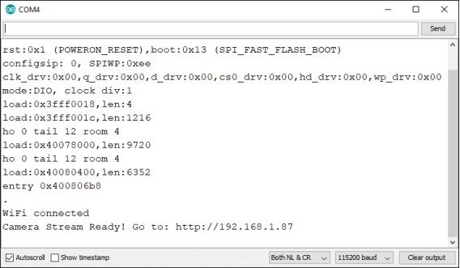 

 

将打印出的IP地址复制到Web浏览器，通过Web浏览器控制机器人的运动（前进、后退、左转、右转、停止）。摄像头将视频流通过MJPEG格式传输到浏览器，我们就实现了一个基于ESP32-CAM的远程控制系统。

​    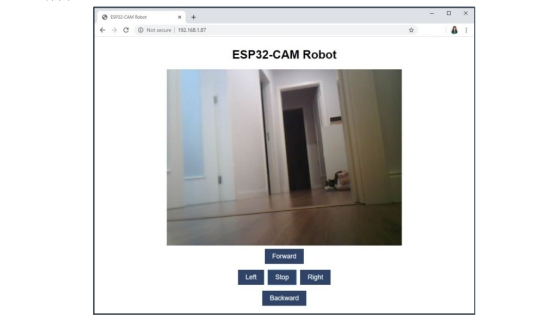